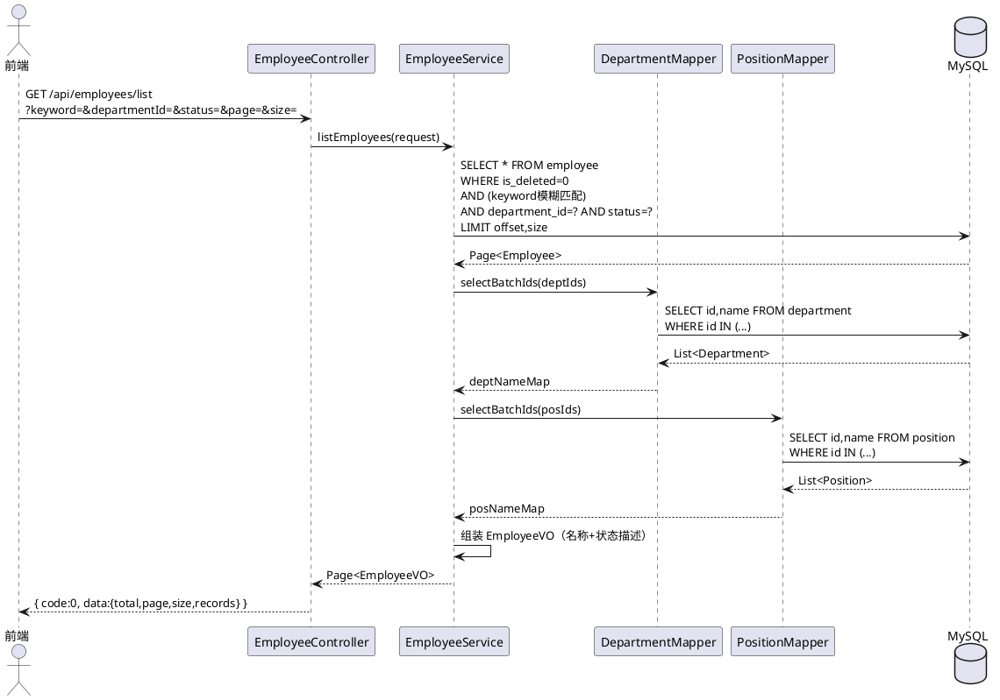
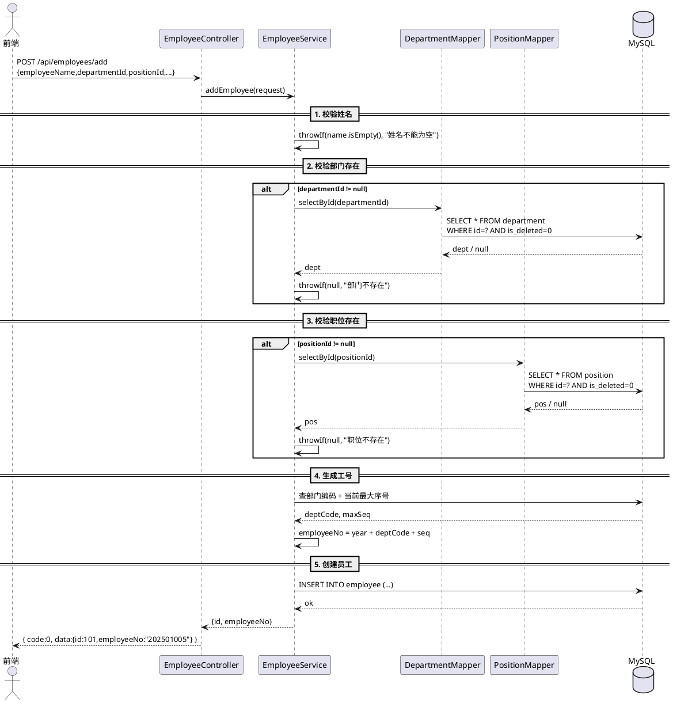
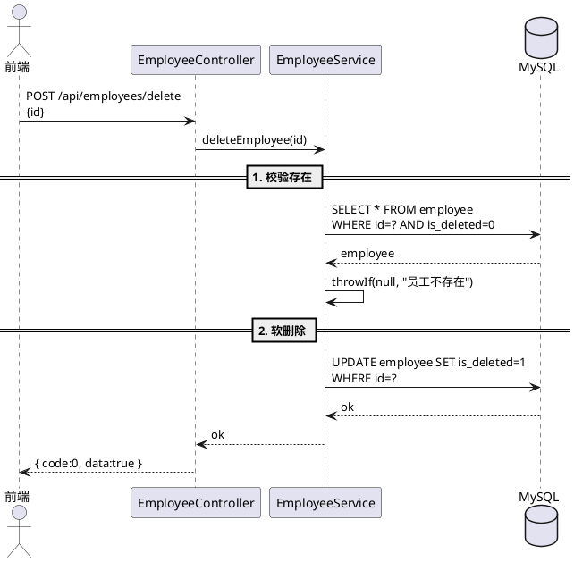

# HRMS-后端-员工档案管理

## 变更记录

| **日期** | **版本** | **修订说明** | **作者** |
| --- | --- | --- | --- |
| 2026-07-08 | 1.0 | 初稿 | - |
| 2026-07-13 | 1.1 | 修订：统一为单表结构，对齐组织架构模块API风格 | - |

## 项目背景

本模块来源于 HRMS（人资管理系统）产品规格说明书中第 4 部分——员工档案管理。当前公司员工档案依赖线下 Excel 管理，存在数据分散、更新不及时等问题。本模块旨在实现员工档案的数字化统一管理，涵盖员工增删改查、搜索过滤、工号生成等核心能力，为入转调离、薪资核算、考勤管理等模块提供基础数据支撑。

### 相关资料

- [人资管理系统（HRMS）详细产品规格说明书](https://yuque.antfin.com/ww89nu/ng0ckr/tttxtqry8pfycc6s)

### 参与人

| **项目负责人** | ... |
| --- | --- |
| **产品经理** | ... |
| **设计师** | ... |
| **工程师** | ... |

## 技术栈

| 层级 | 技术 |
|---|---|
| 框架 | Spring Boot 2.7.2 |
| ORM | MyBatis-Plus 3.5.2（逻辑删除：`@TableLogic` 注解字段 `isDeleted`） |
| 数据库 | MySQL 8.0（表列名下划线命名，`map-underscore-to-camel-case: false`） |
| 接口文档 | Knife4j |

## 功能模块

1. **员工档案 CRUD**：新增、编辑、删除（软删除）、详情查询
2. **员工列表查询**：分页列表，支持关键词、部门、职位、状态筛选
3. **工号自动生成**：格式 `年份(4位) + 部门编码(2位) + 序号(3位)`
4. **关联查询**：列表/详情中关联展示部门名称、职位名称、职级范围

### 功能模块树

```plain
员工档案管理
├── 员工列表查询（分页 + 筛选）
├── 员工详情查询
├── 员工新增（入职建档）
├── 员工编辑
├── 员工删除（软删除，校验关联数据）
├── 工号生成
└── 关联数据展示（部门名、职位名）
```

## 数据库设计

### 员工表 employee

> 单表存储员工全部信息。表使用下划线列名，Java 实体通过 `@TableField` 映射。

```sql
CREATE TABLE IF NOT EXISTS `employee` (
    `id`                       BIGINT          AUTO_INCREMENT COMMENT '主键ID' PRIMARY KEY,
    `employee_name`            VARCHAR(128)    NOT NULL COMMENT '员工姓名（真实姓名）',
    `user_id`                  BIGINT          NULL COMMENT '关联用户ID',
    `employee_no`              VARCHAR(16)     NOT NULL COMMENT '工号，格式: 年份(4)+部门编码(2)+序号(3)',
    `status`                   TINYINT         NOT NULL DEFAULT 1 COMMENT '状态：0=离职 1=在职 2=试用期',
    `gender`                   TINYINT         NOT NULL DEFAULT 0 COMMENT '性别: 0=女 1=男',
    `id_card`                  VARCHAR(256)    DEFAULT NULL COMMENT '身份证号（加密存储）',
    `hire_date`                DATETIME        NULL COMMENT '入职日期',
    `hire_type`                TINYINT         NULL COMMENT '入职类型',
    `department_id`            BIGINT          NULL COMMENT '部门ID，关联 department.id',
    `position_id`              BIGINT          NULL COMMENT '职位ID，关联 position.id',
    `employment_type`          VARCHAR(16)     NOT NULL COMMENT '录用类型: FULL_TIME=全职, PART_TIME=兼职, INTERN=实习',
    `email`                    VARCHAR(256)    NULL COMMENT '邮箱',
    `current_address`          VARCHAR(512)    NULL COMMENT '现居住地址',
    `emergency_contact_name`   VARCHAR(128)    NULL COMMENT '紧急联系人姓名',
    `emergency_contact_phone`  VARCHAR(32)     NULL COMMENT '紧急联系人电话',
    `create_time`              DATETIME        NOT NULL DEFAULT CURRENT_TIMESTAMP COMMENT '创建时间',
    `update_time`              DATETIME        NOT NULL DEFAULT CURRENT_TIMESTAMP ON UPDATE CURRENT_TIMESTAMP COMMENT '更新时间',
    `is_deleted`               TINYINT         NOT NULL DEFAULT 0 COMMENT '逻辑删除：0=否 1=是',
    UNIQUE KEY `uk_employee_no` (`employee_no`),
    KEY `idx_department_id` (`department_id`),
    KEY `idx_position_id` (`position_id`),
    KEY `idx_status` (`status`)
) DEFAULT CHARACTER SET = utf8mb4 COMMENT = '员工表';
```

**Java 实体映射（Employee.java）**：

| DB 列名 | Java 字段 | 类型 | 说明 |
|---|---|---|---|
| `employee_name` | `employeeName` | String | `@TableField("employee_name")` |
| `user_id` | `userId` | Long | |
| `employee_no` | `employeeNo` | String | |
| `status` | `status` | Integer | 0=离职, 1=在职, 2=试用期 |
| `gender` | `gender` | Integer | 0=女, 1=男 |
| `id_card` | `idCard` | String | 加密存储 |
| `hire_date` | `hireDate` | Date | |
| `hire_type` | `hireType` | Integer | |
| `department_id` | `departmentId` | Long | |
| `position_id` | `positionId` | Long | |
| `employment_type` | `employmentType` | String | |
| `email` | `email` | String | |
| `current_address` | `currentAddress` | String | |
| `emergency_contact_name` | `emergencyContactName` | String | |
| `emergency_contact_phone` | `emergencyContactPhone` | String | |
| `create_time` | `createTime` | Date | |
| `update_time` | `updateTime` | Date | |
| `is_deleted` | `isDeleted` | Integer | `@TableLogic` |

## API 设计

> 基础路径：`/api`（`server.servlet.context-path=/api`）
>
> 统一响应：`{ "code": 0, "data": ..., "message": "ok" }`

---

### 1. 查询员工列表

```
GET /api/employees/list?keyword=张三&departmentId=7&status=1&page=1&size=20
```

**请求参数**（Query String）：

| **参数** | **类型** | **必填** | **描述** |
| --- | --- | --- | --- |
| keyword | String | 否 | 模糊搜索（姓名/工号/手机号） |
| departmentId | Long | 否 | 部门ID过滤 |
| positionId | Long | 否 | 职位ID过滤 |
| status | Integer | 否 | 在职状态：0=离职 1=在职 2=试用期 |
| page | Integer | 否 | 页码，默认 1 |
| size | Integer | 否 | 每页条数，默认 20 |

**响应格式**：

```json
{
  "code": 0,
  "message": "ok",
  "data": {
    "total": 156,
    "page": 1,
    "size": 20,
    "records": [
      {
        "id": 101,
        "employeeNo": "202500001",
        "employeeName": "张三",
        "gender": 1,
        "status": 1,
        "statusDesc": "在职",
        "departmentId": 7,
        "departmentName": "技术部",
        "positionId": 3,
        "positionName": "高级开发工程师",
        "email": "zhangsan@example.com",
        "hireDate": "2025-01-15",
        "createTime": "2025-01-15T09:00:00"
      }
    ]
  }
}
```

---

### 2. 查询员工详情

```
GET /api/employees/detail?id=101
```

**响应格式**：

```json
{
  "code": 0,
  "message": "ok",
  "data": {
    "id": 101,
    "employeeNo": "202500001",
    "employeeName": "张三",
    "userId": 1001,
    "status": 1,
    "statusDesc": "在职",
    "gender": 1,
    "genderDesc": "男",
    "idCard": "3301**********1234",
    "hireDate": "2025-01-15",
    "hireType": 1,
    "departmentId": 7,
    "departmentName": "技术部",
    "positionId": 3,
    "positionName": "高级开发工程师",
    "employmentType": "FULL_TIME",
    "email": "zhangsan@example.com",
    "currentAddress": "浙江省杭州市...",
    "emergencyContactName": "张父",
    "emergencyContactPhone": "139****5678",
    "createTime": "2025-01-15T09:00:00",
    "updateTime": "2025-06-01T14:30:00"
  }
}
```

---

### 3. 新增员工

```
POST /api/employees/add
Content-Type: application/json
```

**请求体**：

```json
{
  "employeeName": "张三",
  "gender": 1,
  "idCard": "330106199506151234",
  "hireDate": "2025-01-15",
  "hireType": 1,
  "departmentId": 7,
  "positionId": 3,
  "employmentType": "FULL_TIME",
  "email": "zhangsan@example.com",
  "currentAddress": "浙江省杭州市...",
  "emergencyContactName": "张父",
  "emergencyContactPhone": "13900005678"
}
```

| **参数** | **类型** | **必填** | **描述** |
| --- | --- | --- | --- |
| employeeName | String | 是 | 员工姓名，最长32字符 |
| gender | Integer | 是 | 性别：0=女 1=男 |
| idCard | String | 否 | 身份证号 |
| hireDate | Date | 是 | 入职日期 |
| hireType | Integer | 否 | 入职类型 |
| departmentId | Long | 否 | 部门ID，若填写必须真实存在 |
| positionId | Long | 否 | 职位ID，若填写必须真实存在 |
| employmentType | String | 是 | 录用类型：FULL_TIME/PART_TIME/INTERN |
| email | String | 否 | 邮箱 |
| currentAddress | String | 否 | 现居住地址 |
| emergencyContactName | String | 否 | 紧急联系人姓名 |
| emergencyContactPhone | String | 否 | 紧急联系人电话 |

**校验规则**：
- `employeeName` 不能为空
- `departmentId` 若填写，对应的部门必须逻辑存在
- `positionId` 若填写，对应的职位必须逻辑存在
- 工号由系统自动生成（年份 + 部门编码 + 序号）

**成功响应**：

```json
{ "code": 0, "message": "ok", "data": { "id": 101, "employeeNo": "202500001" } }
```

---

### 4. 更新员工

```
PUT /api/employees/update
Content-Type: application/json
```

**请求体**：

```json
{
  "id": 101,
  "employeeName": "张三",
  "gender": 1,
  "departmentId": 8,
  "positionId": 4,
  "email": "newemail@example.com"
}
```

| **参数** | **类型** | **必填** | **描述** |
| --- | --- | --- | --- |
| id | Long | 是 | 员工ID（在请求体中） |
| employeeName | String | 否 | 员工姓名 |
| gender | Integer | 否 | 性别 |
| departmentId | Long | 否 | 部门ID |
| positionId | Long | 否 | 职位ID |
| email | String | 否 | 邮箱 |
| ... | | 否 | 其他可编辑字段 |

**说明**：只更新传入的非 null 字段；`employeeNo`（工号）不可修改。

**成功响应**：

```json
{ "code": 0, "message": "ok", "data": true }
```

---

### 5. 删除员工

```
POST /api/employees/delete
Content-Type: application/json
```

**请求体**：

```json
{ "id": 101 }
```

**校验规则**：
- 员工存在且未被删除
- 检查是否有关联业务数据（如待处理的审批流等）

**成功响应**：

```json
{ "code": 0, "message": "ok", "data": true }
```

---

### 6. 生成工号

```
POST /api/employees/generate-employee-no
Content-Type: application/json
```

**请求体**：

```json
{ "departmentId": 7 }
```

**响应格式**：

```json
{ "code": 0, "message": "ok", "data": { "employeeNo": "202501005" } }
```

> 工号规则：`年份(4位) + 部门编码(2位) + 序号(3位)`，序号按年度 + 部门维度自增。

---

### 7. 批量导出员工

```
GET /api/employees/export?departmentId=7&status=1
```

> 按当前筛选条件导出 Excel 文件，响应为二进制流。

---

## API 汇总

| # | 方法 | 路径 | 说明 |
|---|---|---|---|
| 1 | GET | `/api/employees/list` | 查询员工列表（分页+筛选） |
| 2 | GET | `/api/employees/detail` | 查询员工详情 |
| 3 | POST | `/api/employees/add` | 新增员工 |
| 4 | PUT | `/api/employees/update` | 更新员工（id在请求体） |
| 5 | POST | `/api/employees/delete` | 删除员工（id在请求体） |
| 6 | POST | `/api/employees/generate-employee-no` | 生成工号 |
| 7 | GET | `/api/employees/export` | 批量导出 Excel |

## 时序图

### 员工列表查询



### 员工新增（含校验）



### 员工删除（含校验）



## 关键技术设计

### 工号生成方案

工号规则：`年份(4位) + 部门编码(2位) + 序号(3位)`，例如 `202501005`。

1. 根据 `departmentId` 查询部门编码
2. 查询该年度 + 该部门编码下的最大序号 `SELECT MAX(SUBSTRING(employee_no, 7)) FROM employee WHERE employee_no LIKE '202501%'`
3. 序号 = 最大值 + 1（从 001 开始），格式化为 3 位
4. `employee_no` 列设唯一索引防止并发重复

### 关联数据查询优化

列表查询时批量收集 `departmentId` 和 `positionId`，一次 SQL 查出所有部门名、职位名，在内存中组装 VO，避免 N+1 查询。

### 敏感字段处理

- `idCard`（身份证号）加密存储，详情接口返回时脱敏（前4后4，中间 `*`）
- `emergencyContactPhone` 同理脱敏

## 代码结构

```
src/main/java/com/limou/hrms/
├── controller/
│   └── EmployeeController.java      # 员工管理（7个端点）
├── service/
│   ├── EmployeeService.java
│   └── impl/
│       └── EmployeeServiceImpl.java
├── mapper/
│   └── EmployeeMapper.java          # 含自定义SQL（工号生成等）
├── model/
│   ├── entity/
│   │   └── Employee.java
│   ├── dto/employee/
│   │   ├── EmployeeAddRequest.java
│   │   ├── EmployeeUpdateRequest.java
│   │   └── EmployeeQueryRequest.java
│   └── vo/
│       └── EmployeeVO.java
```

## 排期

| **阶段** | **内容** | **预估工期** |
| --- | --- | --- |
| 需求评审 | 确认字段定义与工号规则 | 0.5天 |
| 技术方案 | 完成系分文档评审，确认数据库与接口方案 | 1天 |
| 数据库开发 | employee 表已存在，补充索引 | 0天 |
| 后端开发 | CRUD、列表分页、工号生成、关联查询 | 3天 |
| 前端开发 | 列表页、详情页、编辑页 | 3天 |
| 联调测试 | 前后端联调、工号并发测试 | 1.5天 |
| 回归上线 | 全量回归、预发验证、正式上线 | 1天 |

> **总预估工期**：约 10 个工作日
