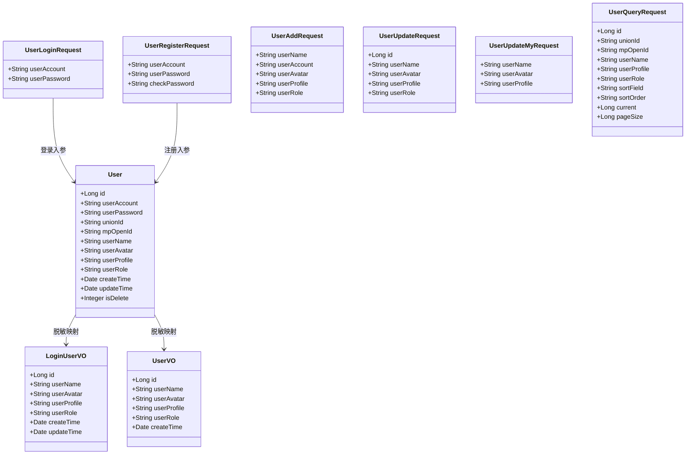
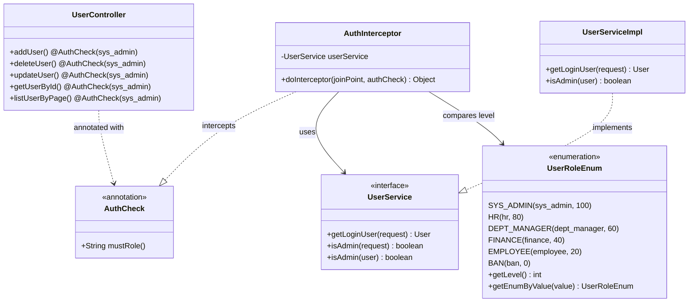
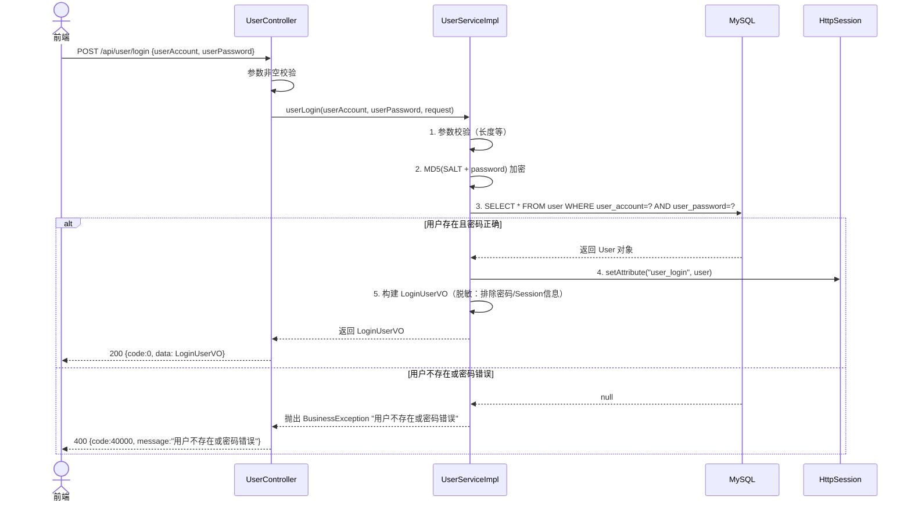
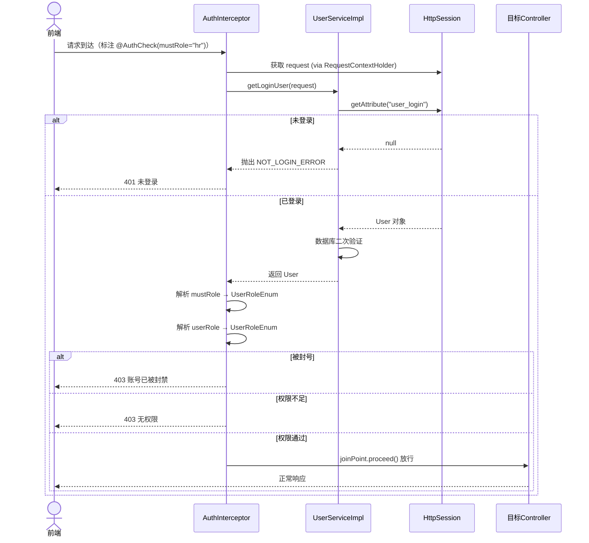
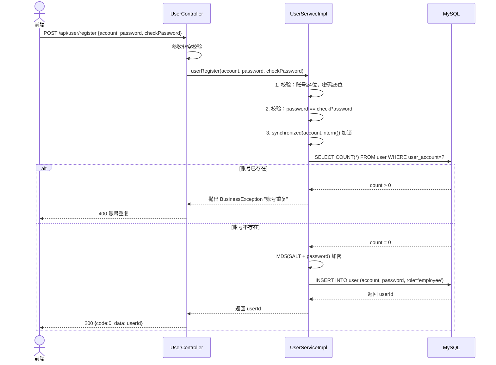

# 后端系分-登录模块

# 登录模块 — 后端系分文档

**版本**：1.0 | **日期**：2026-07-14 | **作者**：—

---

## 变更记录

记录每次修订的内容，方便追溯。

| 日期 | 版本 | 修订说明 | 作者 |
| --- | --- | --- | --- |
| 2026-07-14 | 1.0 | 初稿 | — |

---

## 项目背景

对本次项目的背景以及目标进行描述，方便开发者理解需求，对齐上下文。

本模块来源于 HRMS（人资管理系统）产品规格说明书中第 1 章——用户认证与权限管理。当前系统需要支持多角色（系统管理员、HR 专员、部门主管、财务专员、普通员工）的统一登录入口，提供基于 Session-Cookie 的身份认证机制，并通过 AOP 拦截器实现基于角色层级的接口权限校验。本模块是整个 HRMS 系统的入口模块，是所有其他业务模块运行的前置依赖。

## 相关资料

| 文档 | 说明 |
| --- | --- |
| 人资管理系统（HRMS）详细产品规格说明书 | 第1章 用户认证与权限管理 |
| 前端系分-登录模块.md | 前端系统设计 |
| 前端系分-薪资管理模块.md | 薪资模块前端设计（登录及权限 API 部分） |
| 数据库表设计文档.md | user 表结构 |

## 参与人

| 角色 | 成员 |
| --- | --- |
| 项目负责人 | — |
| 产品经理 | — |
| 设计师 | — |
| 工程师 | — |

---

## 功能模块

描述登录模块涉及的功能与场景。

本模块核心功能包括：

*   **用户注册**：账号密码注册，账号唯一性校验，MD5+固定盐值加密存储
    
*   **用户登录**：账号密码校验 → Session 写入登录态 → 返回脱敏用户信息（LoginUserVO）
    
*   **获取当前登录用户**：从 Session 读取登录态 → 数据库验证用户存在 → 返回脱敏信息
    
*   **用户注销**：清除 Session 中的登录态
    
*   **权限校验**：AOP 切面拦截 `@AuthCheck` 注解 → 基于角色层级的权限模型，高层级角色自动拥有低层级角色的权限
    
*   **用户管理（管理员）**：创建用户（默认密码）、删除用户、更新用户、分页查询用户列表
    
*   **个人信息修改**：当前登录用户修改自己的昵称/头像/简介等信息
    

### 功能模块树

```plaintext
登录模块
├── 用户注册
│   ├── 参数校验（账号长度≥4、密码长度≥8、两次密码一致）
│   ├── 账号唯一性校验（synchronized 加锁）
│   └── MD5 加盐加密 → 写入 user 表
├── 用户登录
│   ├── 参数校验 → 密码 MD5 加密 → 数据库匹配
│   ├── Session 写入登录态（Session Key: "user_login"）
│   └── 返回 LoginUserVO（脱敏：不含密码、unionId、mpOpenId）
├── 获取当前登录用户
│   ├── 从 Session 读取 user 对象
│   ├── 数据库二次验证（防止缓存脏数据）
│   └── 返回 LoginUserVO
├── 用户注销
│   └── Session.removeAttribute("user_login")
├── 权限校验（AOP）
│   ├── @AuthCheck(mustRole = "xxx") 注解
│   ├── AuthInterceptor 切面拦截
│   ├── 角色层级模型：sys_admin(100) > hr(80) > dept_manager(60) > finance(40) > employee(20) > ban(0)
│   └── 被封号用户直接拒绝所有请求
├── 用户管理（管理员专属）
│   ├── 创建用户（默认密码 12345678）
│   ├── 删除用户（物理删除）
│   ├── 更新用户信息（修改角色等）
│   ├── 根据 ID 查询用户
│   └── 分页查询用户列表（支持多条件筛选+排序）
└── 个人信息修改
    └── 修改昵称/头像/简介（不可修改角色和账号）
```
---

## 流程图

### 3-1 用户登录全流程

```plaintext
用户访问系统
     │
     ▼
是否已登录？（Session 中存在 user_login）
     │
  ┌──┴──────────┐
  │              │
 已登录          未登录
  │              │
  ▼              ▼
GET /user/get/login   跳转登录页
  │              │
  │              ▼
  │         输入账号密码 → POST /user/login
  │              │
  │              ▼
  │         ┌─────────────────────────────┐
  │         │ UserServiceImpl.userLogin() │
  │         │ 1. 参数校验                  │
  │         │ 2. 密码 MD5 + SALT 加密      │
  │         │ 3. 数据库匹配                │
  │         │ 4. Session 写入登录态        │
  │         │ 5. 返回 LoginUserVO          │
  │         └──────────────┬──────────────┘
  │                        │
  │                   ┌────┴────┐
  │                   │         │
  │              匹配成功     匹配失败
  │                   │         │
  │                   ▼         ▼
  │            返回 200 +     返回 400
  │            LoginUserVO   "用户不存在或密码错误"
  │                   │
  └───────────────────┘
                      │
                      ▼
              前端存储用户信息 → 跳转首页
```

### 3-2 权限校验流程（AOP 切面）

```plaintext
请求到达 Controller 方法（标注 @AuthCheck(mustRole = "hr")）
     │
     ▼
AuthInterceptor.doInterceptor() 切面拦截
     │
     ▼
从 RequestContextHolder 获取 HttpServletRequest
     │
     ▼
调用 userService.getLoginUser(request) 获取当前用户
     │
     ├── Session 中无 user_login → 抛出 NOT_LOGIN_ERROR
     │
     ▼
解析 mustRole → UserRoleEnum.getEnumByValue(mustRole)
     │
     ├── mustRoleEnum == null → 不需要权限，直接放行 ✅
     │
     ▼
解析当前用户角色 → UserRoleEnum.getEnumByValue(loginUser.userRole)
     │
     ├── userRoleEnum == null → 抛出 NO_AUTH_ERROR
     ├── userRoleEnum == BAN → 抛出 NO_AUTH_ERROR（被封号）
     │
     ▼
比较层级：userRoleEnum.getLevel() >= mustRoleEnum.getLevel()？
     │
  ┌──┴──────────┐
  │              │
 是 ≥           否 <
  │              │
  ▼              ▼
放行 ✅       抛出 NO_AUTH_ERROR ❌
执行目标方法
```

### 3-3 用户注册流程

```plaintext
用户提交注册表单
     │
     ▼
POST /user/register
     │
     ▼
UserController.userRegister()
     │
     ▼
┌─────────────────────────────────────┐
│ UserServiceImpl.userRegister()      │
│ 1. 参数非空校验                     │
│ 2. 账号长度 ≥ 4                     │
│ 3. 密码长度 ≥ 8                     │
│ 4. 两次密码一致                     │
│ 5. synchronized(account.intern())   │
│    → 查库：账号是否已存在           │
│    → 已存在：抛 PARAMS_ERROR        │
│ 6. MD5(SALT + password) 加密        │
│ 7. INSERT user（默认角色 employee）  │
│ 8. 返回 userId                      │
└─────────────────────────────────────┘
     │
     ▼
返回 200 + 新用户 ID
```
---

## UML 图

### 登录模块核心领域模型




### 权限校验组件架构




**枚举说明**：

| 枚举值 | 角色 | 权限等级 | 说明 |
| --- | --- | --- | --- |
| `sys_admin` | 系统管理员 | 100 | 全平台最高权限，可管理用户、配置系统 |
| `hr` | HR 专员 | 80 | 可管理员工档案、薪资核算、考勤管理 |
| `dept_manager` | 部门主管 | 60 | 可查看本部门员工，审批下属请假/转正/调岗 |
| `finance` | 财务专员 | 40 | 可查看薪资数据，执行薪资审批和发放 |
| `employee` | 普通员工 | 20 | 仅可查看个人信息和工资条 |
| `ban` | 被封号 | 0 | 禁止访问系统，所有请求被拒绝 |

**权限层级设计**：高等级角色自动拥有低等级角色的所有接口权限。例如 `@AuthCheck(mustRole = "hr")` 时，`sys_admin`（100）和 `hr`（80）均可通过，但 `dept_manager`（60）及以下不可通过。

---

## 时序图

### 用户登录时序




### 权限校验时序




### 用户注册时序



---

## 数据库设计

### 用户表 user

```sql
CREATE TABLE `user` (
    `id`            BIGINT        NOT NULL COMMENT '主键，雪花算法',
    `user_account`  VARCHAR(256)  NOT NULL COMMENT '登录账号（工号）',
    `user_password` VARCHAR(512)  NOT NULL COMMENT '密码，MD5 加盐',
    `union_id`      VARCHAR(256)  DEFAULT NULL COMMENT '微信开放平台 UnionID（预留）',
    `mp_open_id`    VARCHAR(256)  DEFAULT NULL COMMENT '公众号 OpenID（预留）',
    `user_name`     VARCHAR(256)  DEFAULT NULL COMMENT '用户昵称 / 员工姓名',
    `user_avatar`   VARCHAR(1024) DEFAULT NULL COMMENT '头像 URL',
    `user_profile`  VARCHAR(512)  DEFAULT NULL COMMENT '简介',
    `user_role`     VARCHAR(256)  NOT NULL DEFAULT 'employee' COMMENT '角色：sys_admin=系统管理员, hr=HR专员, dept_manager=部门主管, finance=财务专员, employee=普通员工',
    `create_time`   DATETIME      NOT NULL DEFAULT CURRENT_TIMESTAMP COMMENT '创建时间',
    `update_time`   DATETIME      NOT NULL DEFAULT CURRENT_TIMESTAMP ON UPDATE CURRENT_TIMESTAMP COMMENT '更新时间',
    `is_delete`     TINYINT       NOT NULL DEFAULT 0 COMMENT '逻辑删除：0=正常, 1=删除',
    PRIMARY KEY (`id`),
    UNIQUE INDEX `uk_user_account` (`user_account`),
    INDEX `idx_union_id` (`union_id`),
    INDEX `idx_mp_open_id` (`mp_open_id`)
) ENGINE=InnoDB DEFAULT CHARSET=utf8mb4 COLLATE=utf8mb4_unicode_ci COMMENT='用户表：登录认证 + 角色，全平台人员基础表';
```

**字段说明**：

| 字段 | 类型 | 说明 |
| --- | --- | --- |
| `id` | BIGINT | 主键，雪花算法生成，全局唯一 |
| `user_account` | VARCHAR(256) | 登录账号，实际使用中即员工工号，唯一索引保证不重复 |
| `user_password` | VARCHAR(512) | MD5 加盐加密后的密码，不可逆 |
| `union_id` | VARCHAR(256) | 微信开放平台 UnionID，预留字段，支持未来微信登录 |
| `mp_open_id` | VARCHAR(256) | 公众号 OpenID，预留字段 |
| `user_name` | VARCHAR(256) | 用户昵称/员工姓名，登录后展示用 |
| `user_avatar` | VARCHAR(1024) | 头像 URL，可为外部链接 |
| `user_profile` | VARCHAR(512) | 用户简介，可选 |
| `user_role` | VARCHAR(256) | 角色标识，默认 `employee`，枚举值见 `UserRoleEnum` |
| `is_delete` | TINYINT | MyBatis-Plus `@TableLogic` 逻辑删除 |

---

## API 设计

### 通用说明

| 项目 | 说明 |
| --- | --- |
| 基础路径 | `/api` |
| 认证方式 | Session-Cookie（`JSESSIONID`），Axios 需配置 `withCredentials: true` |
| 响应格式 | `{"code": 0, "message": "success", "data": {...}}` |
| 成功判定 | `code = 0` |
| 分页格式 | `{"total": N, "records": [...], "size": S, "current": P}` |

---

### 1. 用户注册

```plaintext
POST /api/user/register
```

**请求参数**

| 参数 | 类型 | 必填 | 描述 |
| --- | --- | --- | --- |
| userAccount | String | 是 | 登录账号，长度 ≥ 4 |
| userPassword | String | 是 | 密码，长度 ≥ 8 |
| checkPassword | String | 是 | 确认密码，必须与 userPassword 一致 |

**请求示例**

```json
{
  "userAccount": "zhangsan",
  "userPassword": "12345678",
  "checkPassword": "12345678"
}
```

**响应格式**

```json
{
  "code": 0,
  "message": "success",
  "data": 1234567890123456789
}
```

**校验规则**

| 规则 | 错误提示 |
| --- | --- |
| 任一字段为空 | "参数为空" |
| userAccount 长度 < 4 | "用户账号过短" |
| userPassword 长度 < 8 | "用户密码过短" |
| userPassword ≠ checkPassword | "两次输入的密码不一致" |
| 账号已存在 | "账号重复" |

---

### 2. 用户登录

```plaintext
POST /api/user/login
```

**请求参数**

| 参数 | 类型 | 必填 | 描述 |
| --- | --- | --- | --- |
| userAccount | String | 是 | 登录账号 |
| userPassword | String | 是 | 密码，长度 ≥ 8 |

**请求示例**

```json
{
  "userAccount": "zhangsan",
  "userPassword": "12345678"
}
```

**响应格式**

```json
{
  "code": 0,
  "message": "success",
  "data": {
    "id": 1234567890123456789,
    "userName": "张三",
    "userAvatar": "https://example.com/avatar.jpg",
    "userProfile": "技术部工程师",
    "userRole": "employee",
    "createTime": "2026-01-01T09:00:00",
    "updateTime": "2026-07-01T09:00:00"
  }
}
```

**说明**：

*   `LoginUserVO` 不包含 `userPassword`、`unionId`、`mpOpenId` 等敏感字段
    
*   登录成功后 Session 中写入完整的 `User` 对象（含敏感字段，服务端使用）
    
*   前端仅接收脱敏后的 `LoginUserVO`
    

**错误响应**

| 场景 | HTTP 状态 | message |
| --- | --- | --- |
| 参数为空 | 400 | "参数为空" |
| 账号或密码错误 | 400 | "用户不存在或密码错误" |

---

### 3. 获取当前登录用户

```plaintext
GET /api/user/get/login
```

**请求参数**：无（从 Session 自动获取）

**响应格式**：同登录接口的 `LoginUserVO`

**说明**：

*   前端页面刷新后调用此接口恢复用户信息
    
*   未登录时抛出 `NOT_LOGIN_ERROR`（401）
    

---

### 4. 用户注销

```plaintext
POST /api/user/logout
```

**请求参数**：无

**响应格式**

```json
{
  "code": 0,
  "message": "success",
  "data": true
}
```

**说明**：移除 Session 中的 `user_login` 属性。已登录状态下调用，未登录调用则抛异常。

---

### 5. 创建用户（管理员）

```plaintext
POST /api/user/add
```

**权限**：`@AuthCheck(mustRole = "sys_admin")`

**请求参数**

| 参数 | 类型 | 必填 | 描述 |
| --- | --- | --- | --- |
| userName | String | 否 | 用户昵称 |
| userAccount | String | 是 | 登录账号 |
| userAvatar | String | 否 | 头像 URL |
| userProfile | String | 否 | 用户简介 |
| userRole | String | 否 | 角色标识，默认 employee |

**说明**：密码默认为 `12345678`，服务端自动 MD5 加盐加密。

---

### 6. 删除用户（管理员）

```plaintext
POST /api/user/delete
```

**权限**：`@AuthCheck(mustRole = "sys_admin")`

**请求参数**

| 参数 | 类型 | 必填 | 描述 |
| --- | --- | --- | --- |
| id | Long | 是 | 用户 ID |

**说明**：物理删除（`userService.removeById`），不可恢复。

---

### 7. 更新用户（管理员）

```plaintext
POST /api/user/update
```

**权限**：`@AuthCheck(mustRole = "sys_admin")`

**请求参数**

| 参数 | 类型 | 必填 | 描述 |
| --- | --- | --- | --- |
| id | Long | 是 | 用户 ID |
| userName | String | 否 | 用户昵称 |
| userAvatar | String | 否 | 头像 URL |
| userProfile | String | 否 | 用户简介 |
| userRole | String | 否 | 角色标识 |

---

### 8. 根据 ID 获取用户（管理员）

```plaintext
GET /api/user/get?id={id}
```

**权限**：`@AuthCheck(mustRole = "sys_admin")`

**请求参数**

| 参数 | 类型 | 必填 | 描述 |
| --- | --- | --- | --- |
| id | Long | 是 | 用户 ID（Query 参数） |

**响应格式**：返回完整 `User` 对象（含 `userPassword` 等敏感字段，仅管理员可见）。

---

### 9. 分页获取用户列表（管理员）

```plaintext
POST /api/user/list/page
```

**权限**：`@AuthCheck(mustRole = "sys_admin")`

**请求参数**

| 参数 | 类型 | 必填 | 描述 |
| --- | --- | --- | --- |
| id | Long | 否 | 按 ID 精确查询 |
| userName | String | 否 | 按昵称模糊查询 |
| userProfile | String | 否 | 按简介模糊查询 |
| userRole | String | 否 | 按角色精确筛选 |
| sortField | String | 否 | 排序字段 |
| sortOrder | String | 否 | 排序方向：asc / desc |
| current | Long | 否 | 页码，默认 1 |
| pageSize | Long | 否 | 每页条数 |

**响应格式**：MyBatis-Plus `Page<User>` 对象。

---

### 10. 修改个人信息

```plaintext
POST /api/user/update/my
```

**请求参数**

| 参数 | 类型 | 必填 | 描述 |
| --- | --- | --- | --- |
| userName | String | 否 | 新的昵称 |
| userAvatar | String | 否 | 新的头像 URL |
| userProfile | String | 否 | 新的个人简介 |

**说明**：仅允许修改昵称/头像/简介，不可修改账号、密码（需单独密码修改接口）、角色。`id` 从当前登录 Session 自动获取。

---

## 关键技术设计

### 密码加密方案

采用 **MD5 + 固定盐值** 的单向加密方案：

```plaintext
加密密码 = MD5("limou" + 明文密码)
```

| 项目 | 说明 |
| --- | --- |
| 加密算法 | MD5（不可逆） |
| 盐值 | `limou`（固定盐值，硬编码在 UserServiceImpl.SALT） |
| 存储内容 | 32 位十六进制字符串 |
| 校验方式 | 对用户输入的密码同样 MD5 加密后与数据库比对 |

> **安全建议**：当前为固定盐值方案，生产环境建议升级为 BCrypt 或每个用户独立随机盐值的 PBKDF2，提升抗彩虹表攻击能力。

### Session-Cookie 认证机制

| 项目 | 说明 |
| --- | --- |
| Session Key | `user_login` |
| 存储内容 | 完整 `User` 对象（含 id / account / password / role 等） |
| 存储位置 | 服务端 HttpSession（默认内存存储，可扩展为 Redis 共享 Session） |
| 过期时间 | Tomcat 默认 30 分钟（`server.servlet.session.timeout`） |
| Cookie | 浏览器端自动发送 `JSESSIONID` |

**Session 安全性**：

*   `getLoginUser()` 在从 Session 取到 User 后，会再查一次数据库验证用户存在性，防止 Session 中存储了已被删除的用户
    
*   注销时调用 `session.removeAttribute("user_login")` 主动清除
    

### 角色层级权限模型

采用**数值层级模型**替代传统的 RBAC 字符串匹配：

```plaintext
sys_admin(100) > hr(80) > dept_manager(60) > finance(40) > employee(20) > ban(0)
```

**核心逻辑**（`AuthInterceptor.doInterceptor()`）：

```java
// 用户权限等级 >= 所需权限等级即放行
if (userRoleEnum.getLevel() < mustRoleEnum.getLevel()) {
    throw new BusinessException(ErrorCode.NO_AUTH_ERROR);
}
```

**优势**：

*   无需为每个接口单独配置多个角色，高层级角色自动继承低层级角色权限
    
*   新增中间角色只需定义其层级值即可，无需修改已有接口的权限配置
    
*   代码简洁，O(1) 复杂度比较
    

### 注册并发控制

使用 `synchronized (userAccount.intern())` 对同一账号的注册请求加锁：

```java
synchronized (userAccount.intern()) {
    // 查库 → 判断是否已存在 → 插入
}
```

*   `String.intern()` 确保同一字符串内容指向同一个 JVM 常量池对象，实现字符串级别的锁
    
*   防止并发注册同一账号导致唯一索引冲突
    

### VO 脱敏设计

| VO 类型 | 包含字段 | 使用场景 |
| --- | --- | --- |
| `LoginUserVO` | id, userName, userAvatar, userProfile, userRole, createTime, updateTime | 登录返回、获取当前用户 |
| `UserVO` | id, userName, userAvatar, userProfile, userRole, createTime | 列表展示 |
| `User`（原始） | 全部字段（含 password, unionId, mpOpenId） | 仅服务端内部使用，管理员查询 |

脱敏通过 `BeanUtils.copyProperties()` 实现字段级别的拷贝，不会将敏感字段暴露到前端。

---

## 排期

对研发时间计划进行排期。

| 阶段 | 内容 | 预估工期 |
| --- | --- | --- |
| 需求评审 | 评审产品规格，确认角色定义、权限模型 | 0.5天 |
| 技术方案 | 完成系分文档评审，确认数据库设计与接口方案 | 0.5天 |
| 数据库开发 | 建表（user）、索引优化 | 0.5天 |
| 后端开发-注册登录 | 注册 + 登录 + 注销 + 获取当前用户 | 1天 |
| 后端开发-权限体系 | AOP 拦截器 + 注解 + 角色枚举 + 层级模型 | 1天 |
| 后端开发-用户管理 | 管理员 CRUD 接口 + 分页查询 + 个人信息修改 | 1天 |
| 前端开发 | 登录页 + 注册页 + 权限指令 + 路由守卫 + Store | 2天 |
| 联调测试 | 前后端联调、多角色场景测试、Session 超时测试 | 1天 |
| 回归上线 | 全量回归、预发验证、正式上线 | 0.5天 |

**后端总预估工期**：约 4 个工作日 **前端总预估工期**：约 2 个工作日 **总预估工期**：约 5 个工作日（前后端并行开发）