# HRMS 人力资源管理系统 — 后端系分总文档

> 版本：2.0 | 日期：2026-07-15 | 整合 doc-s/ 全部 8 份后端系分文档

---

## 变更记录

| 日期 | 版本 | 修订说明 | 作者 |
|------|------|----------|------|
| 2026-07-15 | 1.0 | 初稿 | - |
| 2026-07-15 | 2.0 | 补充 UML/时序/流程图 | - |

---

# 一、登录与认证模块

> 来源：`doc-s/后端系分-登录模块.md`

## 1.1 功能概述

本模块是 HRMS 系统的入口，提供 Session-Cookie 认证和 AOP 角色权限校验。

| 功能 | 说明 |
|------|------|
| 用户注册 | 账号密码注册、synchronized 加锁防并发、MD5+固定盐值加密 |
| 用户登录 | 密码校验 → Session 写入 `user_login` → 返回脱敏 LoginUserVO |
| 获取当前用户 | Session 读取 → 数据库二次验证 → 脱敏返回 |
| 用户注销 | Session.removeAttribute("user_login") |
| 权限校验（AOP） | `@AuthCheck` 注解 → AuthInterceptor 切面 → 角色层级比较 |
| 用户管理（管理员） | 创建/删除/更新/分页查询 |
| 个人信息修改 | 仅昵称/头像/简介，不可提权 |

### 功能模块树

```
登录模块
├── 用户注册（参数校验 → 账号唯一性 → MD5加盐加密 → 写入 user 表）
├── 用户登录（参数校验 → MD5加密 → 数据库匹配 → Session写入 → LoginUserVO）
├── 获取当前登录用户（Session读取 → 数据库二次验证 → LoginUserVO）
├── 用户注销（Session.removeAttribute("user_login")）
├── 权限校验（AOP）
│   └── @AuthCheck(mustRole) → AuthInterceptor → 角色层级比较
├── 用户管理（管理员专属，@AuthCheck(sys_admin)）
└── 个人信息修改（昵称/头像/简介，不可提权）
```

## 1.2 流程图

### 用户登录全流程

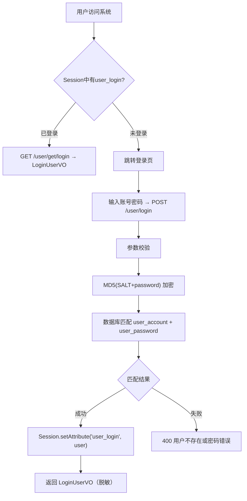

### 用户注册流程

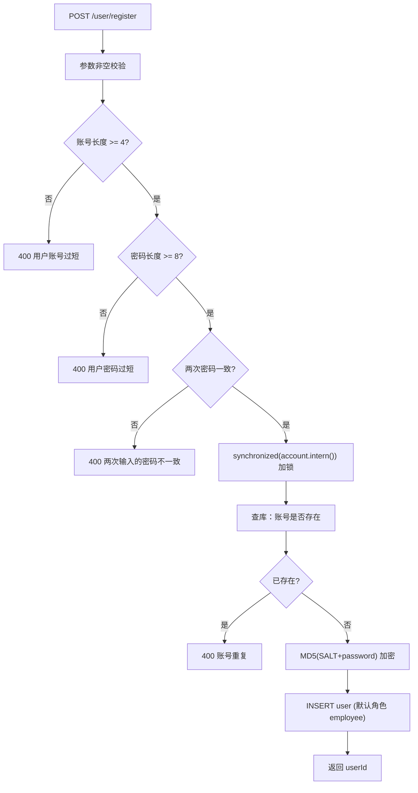

### 权限校验流程（AOP 切面）

```mermaid
flowchart TD
    A["请求到达 @AuthCheck(mustRole='hr')"] --> B[AuthInterceptor 切面拦截]
    B --> C[从 RequestContextHolder 获取 HttpServletRequest]
    C --> D[调用 userService.getLoginUser(request)]
    D --> E{Session中有user_login?}
    E -->|否| F[401 NOT_LOGIN_ERROR]
    E -->|是| G[数据库二次验证用户存在性]
    G --> H{用户存在?}
    H -->|否| F
    H -->|是| I["解析 mustRole → UserRoleEnum"]
    I --> J{mustRole为空?}
    J -->|是| K[放行（无需权限）]
    J -->|否| L["解析用户角色 → UserRoleEnum"]
    L --> M{角色==BAN?}
    M -->|是| N[403 NO_AUTH_ERROR]
    M -->|否| O{"用户层级 >= 所需层级?"}
    O -->|是| P[放行 ✅]
    O -->|否| N
```

## 1.3 UML 类图

### 登录模块核心领域模型

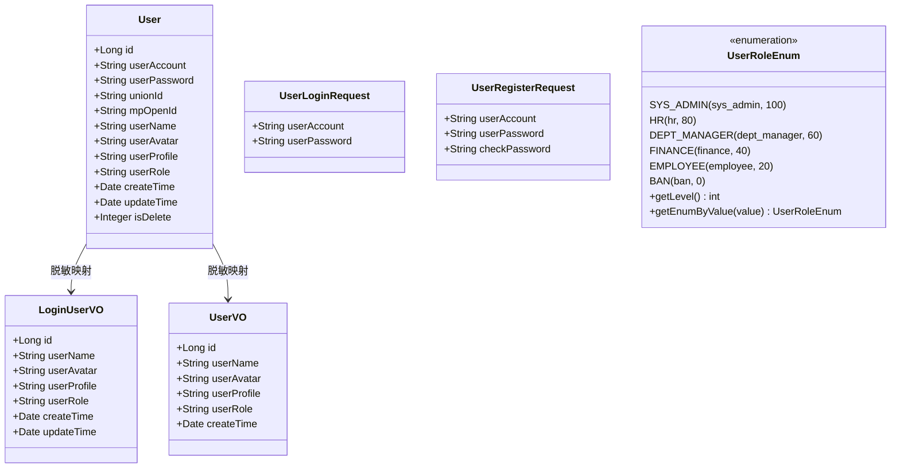

### 权限校验组件架构

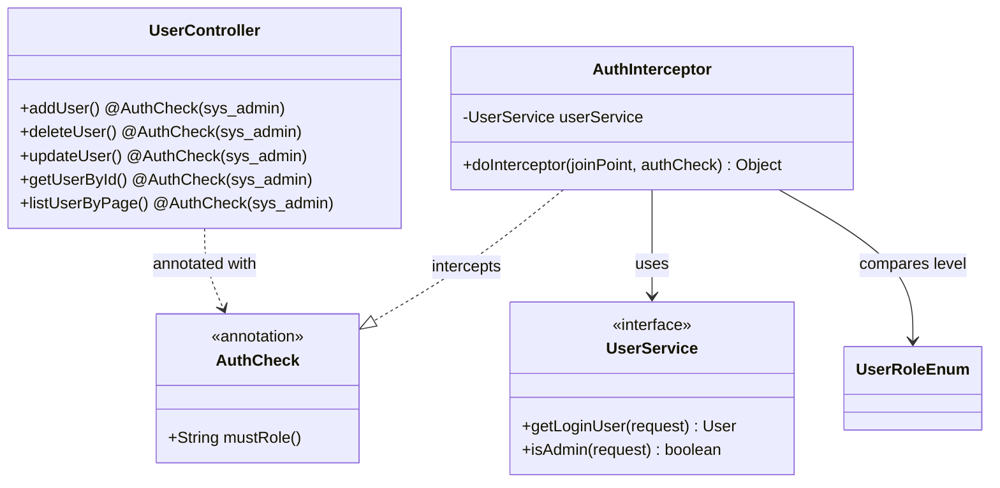

## 1.4 时序图

### 用户登录时序

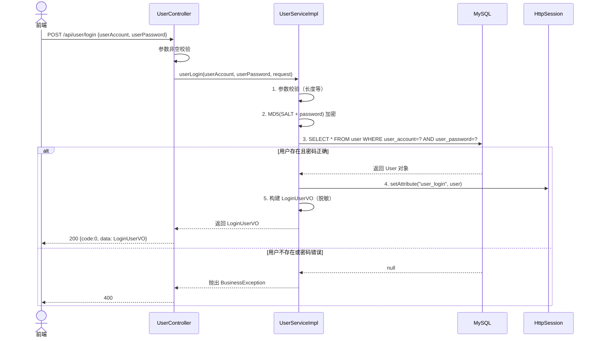

### 权限校验时序

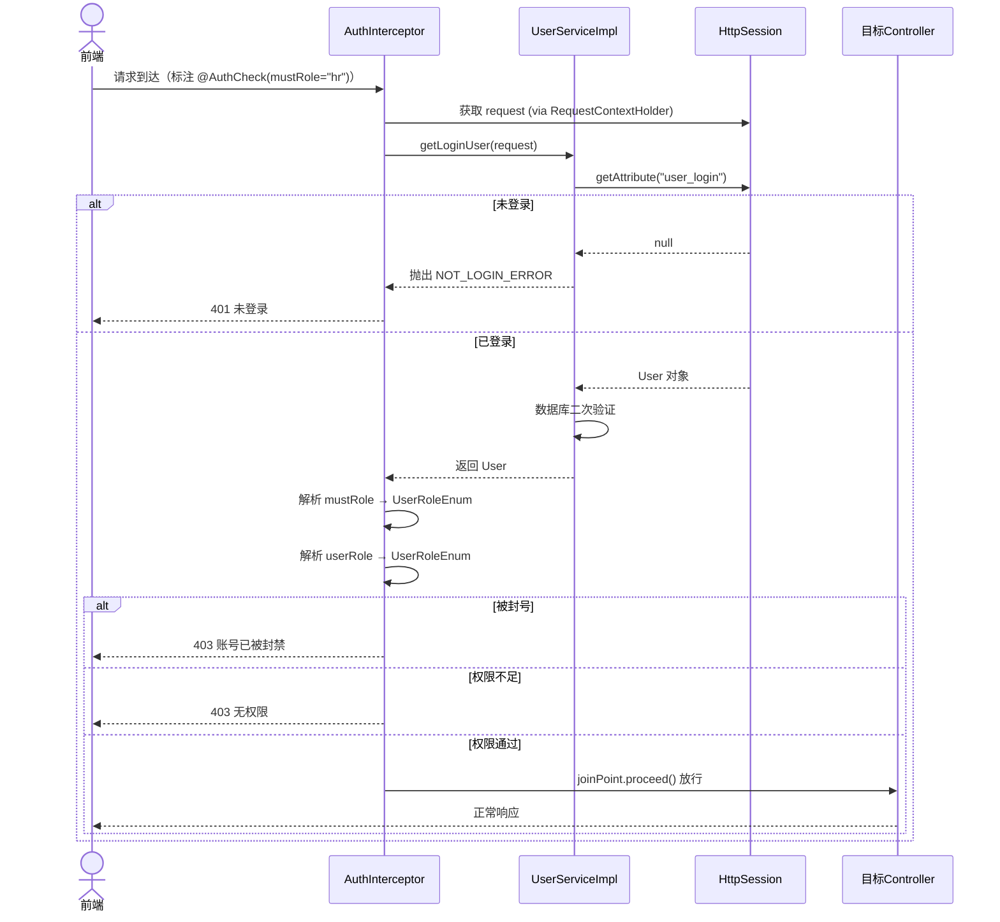

## 1.5 数据库表

涉及 `user` 表，核心字段：

| 字段 | 类型 | 说明 |
|------|------|------|
| `id` | BIGINT PK | 雪花算法 |
| `user_account` | VARCHAR(256) UNIQUE | 登录账号（工号） |
| `user_password` | VARCHAR(512) | MD5("limou" + 明文密码) |
| `user_role` | VARCHAR(256) | sys_admin/hr/dept_manager/finance/employee/ban |
| `user_name` | VARCHAR(256) | 用户昵称 |
| `is_delete` | TINYINT | 逻辑删除 |

## 1.6 API 设计

| 方法 | 路径 | 权限 | 说明 |
|------|------|------|------|
| POST | `/api/user/register` | 无 | 注册 |
| POST | `/api/user/login` | 无 | 登录 → LoginUserVO |
| GET | `/api/user/get/login` | 无 | 获取当前用户（Session） |
| POST | `/api/user/logout` | 无 | 注销 |
| POST | `/api/user/add` | sys_admin | 创建用户，默认密码12345678 |
| POST | `/api/user/delete` | sys_admin | 物理删除 |
| POST | `/api/user/update` | sys_admin | 更新用户信息/角色 |
| POST | `/api/user/list/page` | sys_admin | 分页查询 |
| POST | `/api/user/update/my` | 登录即可 | 修改个人信息 |

## 1.7 关键技术设计

- **密码加密**：`MD5("limou" + 明文)`，生产建议升级 BCrypt
- **注册并发控制**：`synchronized(userAccount.intern())`
- **Session**：Key=`user_login`，超时 30 天
- **二次查库**：getLoginUser() 从 Session 取到 User 后再查一次数据库，防脏数据

---

# 二、组织架构管理模块

> 来源：`doc-s/HRMS-组织架构管理-后端.md`

## 2.1 功能概述

为员工档案、考勤、薪资、审批等下游模块提供组织架构基础数据。

| 功能 | 说明 |
|------|------|
| 部门管理 | 多级树形结构（最大 5 级）、编码管理、负责人设置、排序、人数实时统计（含子部门递归） |
| 职位管理 | 职位序列枚举（M/P/S）、职级范围校验、部门关联、默认试用期配置 |

## 2.2 流程图

### 部门创建流程

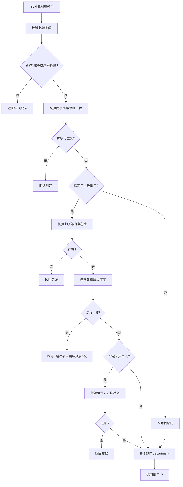

### 部门删除流程

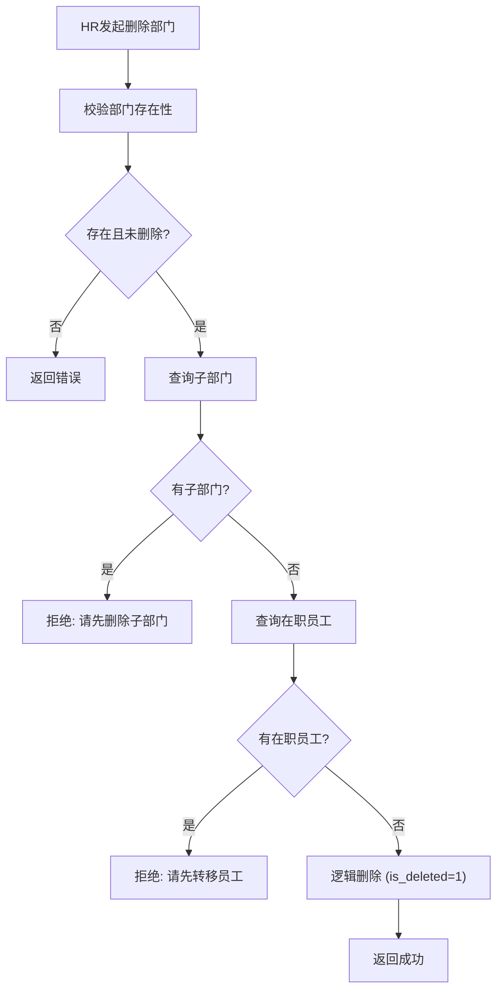

### 部门人数统计流程

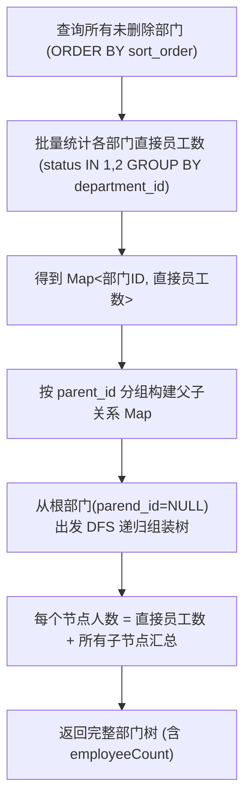

### 职位创建流程

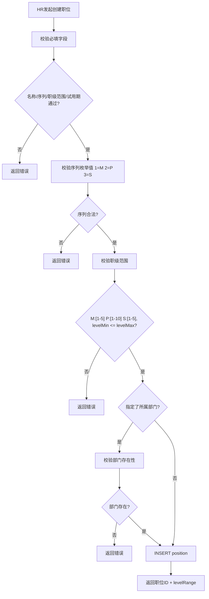

## 2.3 UML 类图

### 组织架构管理核心领域模型

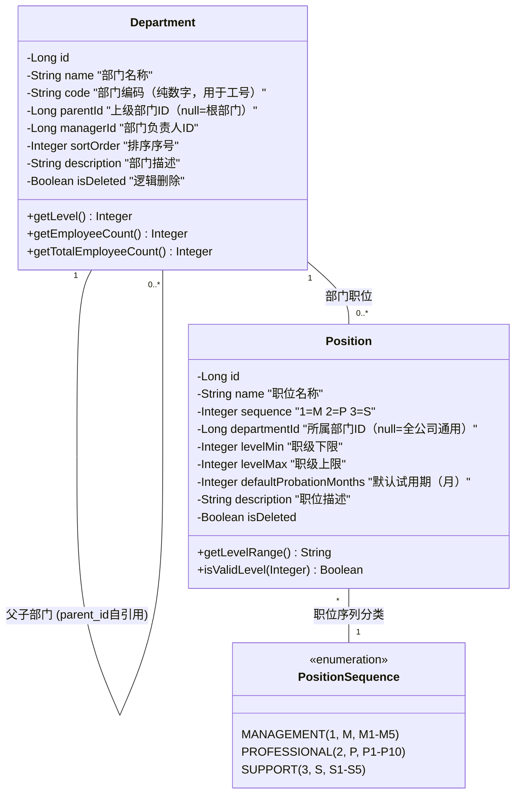

## 2.4 时序图

### 查询部门树时序

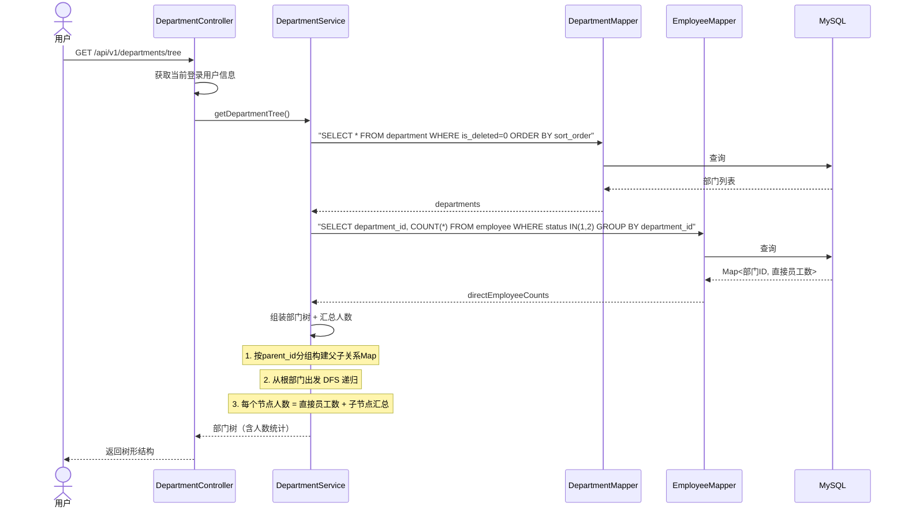

### 创建部门时序

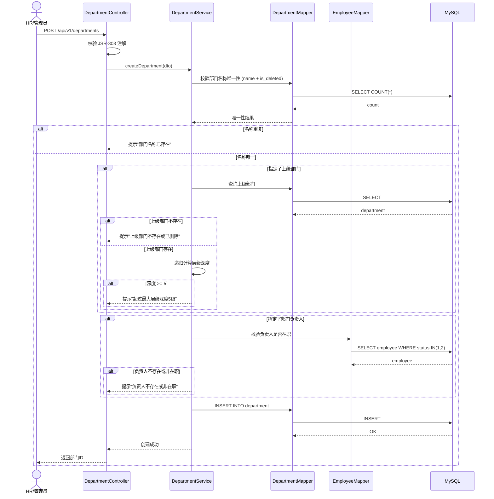

## 2.5 数据库表

### department（部门表）

```sql
CREATE TABLE `department` (
    `id`          BIGINT UNSIGNED NOT NULL AUTO_INCREMENT,
    `name`        VARCHAR(64)     NOT NULL COMMENT '部门名称',
    `code`        VARCHAR(16)     NOT NULL COMMENT '部门编码（纯数字），用于工号生成',
    `parent_id`   BIGINT UNSIGNED DEFAULT NULL COMMENT 'NULL=根部门',
    `manager_id`  BIGINT UNSIGNED DEFAULT NULL COMMENT '部门负责人',
    `sort_order`  INT             NOT NULL DEFAULT 0,
    `description` VARCHAR(256)    DEFAULT NULL,
    `is_deleted`  TINYINT         NOT NULL DEFAULT 0,
    UNIQUE KEY `uk_name` (`name`, `is_deleted`),
    UNIQUE KEY `uk_code` (`code`, `is_deleted`),
    UNIQUE KEY `uk_parent_sort` (`parent_id`, `sort_order`, `is_deleted`)
);
```

### position（职位表）

```sql
CREATE TABLE `position` (
    `id`                       BIGINT UNSIGNED NOT NULL AUTO_INCREMENT,
    `name`                     VARCHAR(64)     NOT NULL,
    `sequence`                 TINYINT         NOT NULL COMMENT '1=M 2=P 3=S',
    `department_id`            BIGINT UNSIGNED DEFAULT NULL COMMENT 'NULL=全公司通用',
    `level_min`                INT             NOT NULL,
    `level_max`                INT             NOT NULL,
    `default_probation_months` INT             NOT NULL DEFAULT 3,
    `description`              VARCHAR(256)    DEFAULT NULL,
    `is_deleted`               TINYINT         NOT NULL DEFAULT 0,
    UNIQUE KEY `uk_name_dept` (`name`, `department_id`, `is_deleted`)
);
```

### 职位序列枚举（代码枚举）

| 枚举值 | 序列 | 职级范围 | 典型职位 |
|--------|------|----------|----------|
| MANAGEMENT(1) | M | M1-M5 | M1主管、M2经理、M3总监、M5VP |
| PROFESSIONAL(2) | P | P1-P10 | P3初级、P5中级、P7高级、P9专家 |
| SUPPORT(3) | S | S1-S5 | 职能等级 |

## 2.6 API 设计

| 方法 | 路径 | 说明 |
|------|------|------|
| GET | `/api/v1/departments/tree` | 部门树（含人数统计，按角色过滤） |
| GET | `/api/v1/departments` | 平铺列表（keyword/parentId 筛选） |
| GET | `/api/v1/departments/{id}` | 部门详情（含直接子部门） |
| POST | `/api/v1/departments` | 创建（校验层级/排序号/负责人） |
| PUT | `/api/v1/departments/{id}` | 更新（防循环引用） |
| DELETE | `/api/v1/departments/{id}` | 逻辑删除（子部门+员工前置检查） |
| GET | `/api/v1/positions` | 职位列表（sequence/departmentId 筛选） |
| GET | `/api/v1/positions/sequences` | 序列枚举查询 |
| POST | `/api/v1/positions` | 创建（校验序列+职级范围） |
| PUT | `/api/v1/positions/{id}` | 更新 |
| DELETE | `/api/v1/positions/{id}` | 逻辑删除（员工关联检查） |

## 2.7 关键技术设计

- **部门树构建**：全量查询 + 内存组装，按 parent_id 分组 DFS 递归，避免 N+1
- **层级深度校验**：从 parent_id 向上递归统计深度，>5 级拒绝
- **循环引用检测**：更新 parent_id 时确保新父节点不是自己的子孙
- **数据权限**：sys_admin/hr 全量；dept_manager 仅管辖子树；employee 仅所在部门

---

# 三、员工档案管理模块

> 来源：`doc-s/HRMS-员工档案管理-后端.md`

## 3.1 功能概述

实现员工档案数字化统一管理，为入转调离、薪资核算、考勤管理提供基础数据。

| 功能 | 说明 |
|------|------|
| 档案字段管理 | 基础信息/个人信息/工作信息/薪资合同信息四类字段 |
| 工号自动生成 | 年份(4位)+部门编码(2位)+序号(3位)，如 202401005 |
| 账号自动创建 | 入职审批通过后自动创建（账号=手机号，初始密码随机） |
| 员工查询 | 默认列表+高级搜索（关键词/部门/职位/状态/职级/入职日期范围） |
| 字段级权限 | 按角色控制敏感字段可见性（身份证/薪资/银行卡/紧急联系人） |

### 功能模块树

```
员工档案管理
├── 创建员工档案（入转调离模块在入职审批通过后调用，四表事务写入）
├── 编辑员工档案（逐字段白名单校验，不允许的提示走流程）
├── 员工详情查询（按角色脱敏，salaryInfo 仅 HR/财务可见）
├── 员工列表查询
│   ├── 默认列表（姓名/工号/部门/职位/职级/状态/入职日期）
│   ├── 高级搜索（关键词/部门多选/职位多选/状态多选/职级多选/日期范围）
│   └── 操作（查看详情/编辑/调岗/离职）
└── 字段级权限（viewableFields / editableFields / flowRequiredFields 三维度）
```

## 3.2 流程图

### 员工档案创建流程

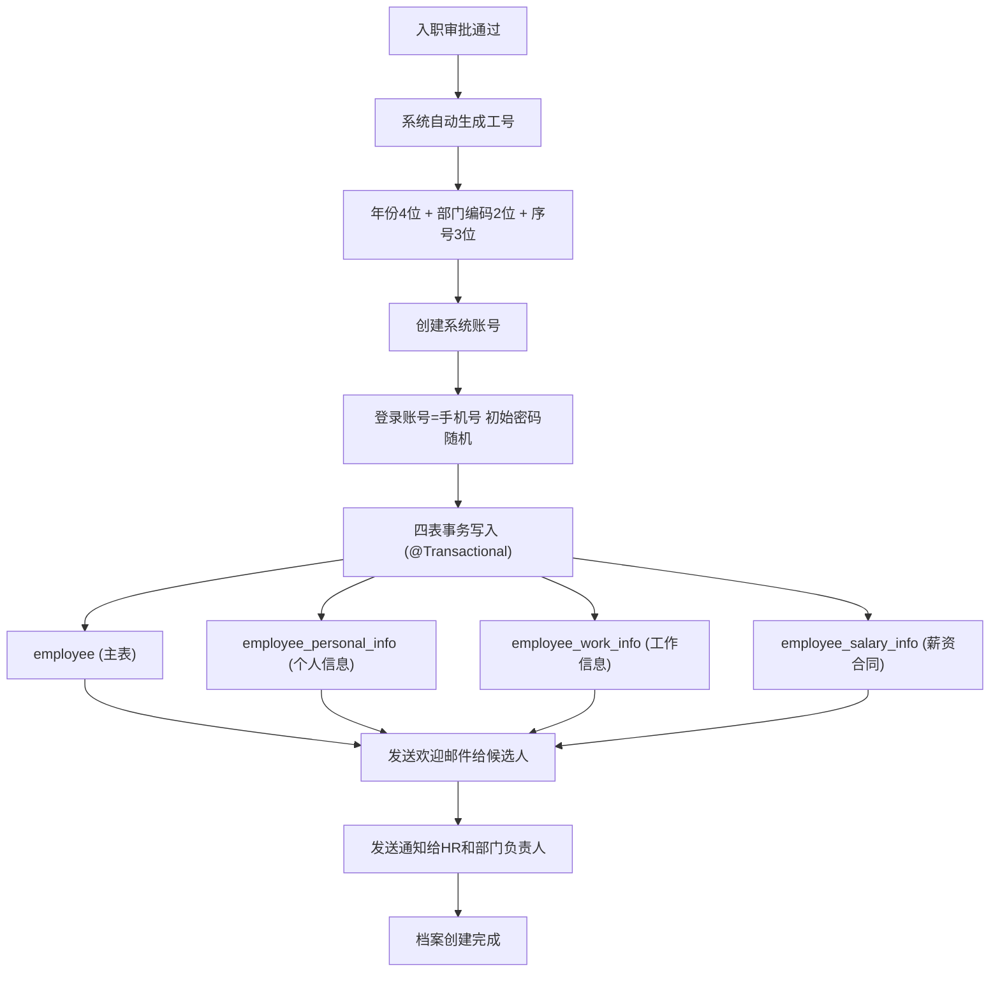

### 字段编辑权限控制流程

```mermaid
flowchart TD
    A[用户点击编辑] --> B["GET /employees/field-permissions"]
    B --> C[获取 editableFields 列表]
    C --> D[渲染编辑表单]
    D --> E{字段在 editableFields 中?}
    E -->|是| F[展示输入框，可编辑]
    E -->|否| G[置灰锁定，提示联系HR]
    F & G --> H[用户提交 PUT /employees/{id}]
    H --> I[后端逐字段校验]
    I --> J{字段在 editableFields 中?}
    J -->|是| K[更新子表 + 记 change_log]
    J -->|否| L[拒绝 + 加入 flowRequiredFields]
    K & L --> M["返回 {updatedFields, flowRequiredFields}"]
```

## 3.3 UML 类图

### 员工档案核心领域模型

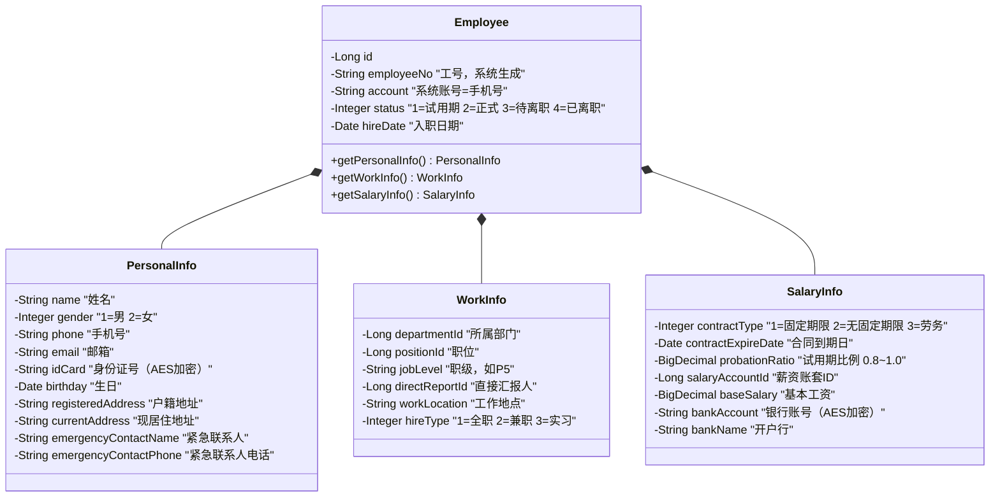

## 3.4 数据库表（6张）

| 表名 | 说明 |
|------|------|
| `employee` | 员工主表（employee_no、account、status、hire_date、hire_type） |
| `employee_personal_info` | 个人信息（name/gender/phone/email/id_card/emergency_contact 等） |
| `employee_work_info` | 工作信息（department_id/position_id/job_level/direct_report_id） |
| `employee_salary_info` | 薪资合同（contract_type/probation_ratio/salary_account_id/base_salary/bank） |
| `employee_no_sequence` | 工号序列表（year+dept_code → current_seq 自增） |
| `employee_change_log` | 档案变更历史（field_name/old_value/new_value/change_type/operator_id） |

### 字段级权限矩阵

| 字段 | HR | 部门主管 | 普通员工 | 财务 |
|------|:--:|:------:|:------:|:--:|
| 姓名 | 查看 | 查看 | 查看(自己) | — |
| 手机号 | 查看 | 查看 | 查看(自己) | — |
| 身份证号 | 查看 | 不可见 | 不可见 | — |
| 薪资信息 | 查看 | 不可见 | 查看(自己) | 查看 |
| 紧急联系人 | 查看 | 不可见 | 查看(自己) | — |
| 银行卡号 | 查看 | 不可见 | 不可见 | — |

## 3.5 API 设计

| 方法 | 路径 | 说明 |
|------|------|------|
| GET | `/api/v1/employees` | 列表（分页+高级搜索，按角色过滤范围） |
| GET | `/api/v1/employees/{id}` | 详情（salaryInfo 仅 HR/财务可见，脱敏） |
| POST | `/api/v1/employees` | 创建（入职审批通过后调用，四表事务） |
| PUT | `/api/v1/employees/{id}` | 更新（逐字段白名单校验） |
| GET | `/api/v1/employees/field-permissions` | 获取字段权限三维度 |
| GET | `/api/v1/employees/statuses` | 在职状态枚举 |

## 3.6 关键技术设计

- **四表事务写入**：`@Transactional` 保证 employee + personal_info + work_info + salary_info 原子性
- **逐字段权限校验**：不传=保持原值；传了且在 editableFields 中=更新+记日志；传了但不在=拒绝+提示走流程
- **MyBatis 数据拦截**：Interceptor 自动追加 WHERE 条件（全量/部门子树/仅自己）
- **AES-256 加密**：身份证号、银行卡号加密存储
- **脱敏规则**：身份证保留前4后4、手机号保留前3后4、银行卡仅显后4位
- **变更审计**：所有字段变更自动记 employee_change_log

---

# 四、入转调离模块

> 来源：`doc-s/入转调离-后端系分.md`

## 4.1 功能概述

覆盖入职、转正、调岗、离职四大异动场景，打通审批流，自动同步员工档案状态。

| 功能 | 说明 |
|------|------|
| 入职管理 | 候选人录入 → 草稿 → 审批 → 自动生成工号+创建账号+写入档案+发邮件 |
| 转正管理 | 提前7天提醒 → HR发起评估 → 审批 → 状态变更 |
| 调岗管理 | HR发起 → 原部门负责人知情 → 新部门负责人接收 → HR备案 → 生效 |
| 离职管理 | HR发起 → 部门负责人确认交接 → HR审批 → 状态变更+账号禁用 |

## 4.2 流程图

### 入职完整状态流转

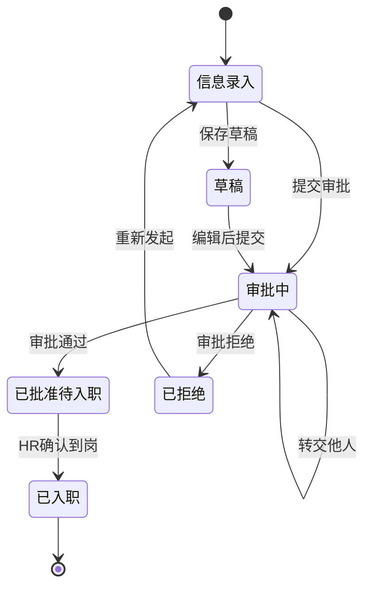

### 转正流程

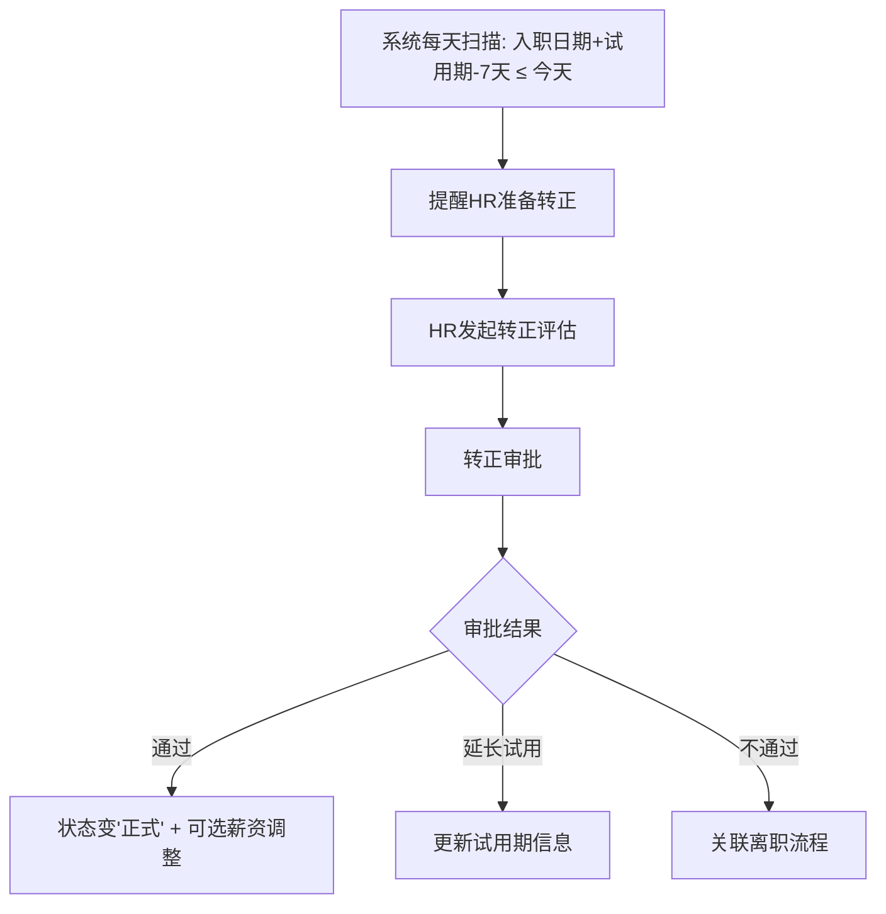

### 调岗流程

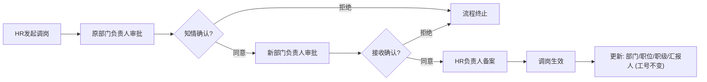

### 离职流程

```mermaid
flowchart TD
    A[HR发起离职] --> B[部门负责人审批]
    B --> C{确认交接?}
    C -->|同意| D[HR负责人审批]
    C -->|拒绝| X[流程终止]
    D --> E{审批通过?}
    E -->|通过| F["状态变'待离职'"]
    E -->|拒绝| X
    F --> G[到达离职日期]
    G --> H["状态变'已离职'"]
    H --> I["账号禁用 + 考勤组移除 + 薪资结算至离职日"]
```

## 4.3 关键 API

| 方法 | 路径 | 说明 |
|------|------|------|
| POST | `/api/v1/onboarding` | 创建入职申请 |
| PUT | `/api/v1/onboarding/{id}` | 编辑（仅草稿） |
| POST | `/api/v1/onboarding/{id}/submit` | 提交审批 |
| POST | `/api/v1/regularization/{employeeId}` | 发起转正 |
| POST | `/api/v1/transfer/{employeeId}` | 发起调岗 |
| POST | `/api/v1/resignation/{employeeId}` | 发起离职 |

> 审批流转统一走审批中心（见第七部分）

---

# 五、考勤管理模块

> 来源：`doc-s/HRMS-考勤管理-后端.md`

## 5.1 功能概述

实现考勤全流程线上化，为薪资核算提供准确的考勤扣款数据。

| 功能 | 说明 |
|------|------|
| 考勤规则配置 | 考勤组（固定班/弹性班/排班制）、班次时间、迟到/早退阈值、IP/GPS限制 |
| 打卡 | 网页端打卡、状态判定（正常/迟到/早退/旷工/缺卡）、请假联动、并发幂等 |
| 请假 | 7种类型、余额计算、多级审批路由、工作交接 |
| 补卡 | 缺卡补卡、每月≤2次、直接上级审批 |
| 加班 | CRUD、自动转入调休(1:1)、过期清理 |
| 统计 | 个人/部门维度、AntV图表数据、HR手动修正+审计 |

## 5.2 流程图

### 打卡流程

```mermaid
flowchart TD
    A["员工点击打卡 (上班/下班)"] --> B[校验打卡条件]
    B --> C{IP白名单/GPS通过?}
    C -->|否| D[拒绝并提示原因]
    C -->|是| E{当天是否有请假?}
    E -->|全天请假| F[拒绝: 当日已请假]
    E -->|半天请假| G{当前时段在请假范围内?}
    G -->|是| F
    G -->|否| H["Redis分布式锁防重复"]
    E -->|无请假| H
    H --> I{打卡类型}
    I -->|上班打卡| J[校验是否已有上班打卡]
    J --> K{已有?}
    K -->|是| L[拒绝: 已完成上班打卡]
    K -->|否| M[记录签到时间 → 判定状态]
    M --> N["正常 / 迟到(规定时间+阈值内) / 旷工半天(超阈值)"]
    I -->|下班打卡| O[校验是否已有下班打卡]
    O --> P{已有?}
    P -->|是| Q[拒绝: 已完成下班打卡]
    P -->|否| R[记录签退时间 → 判定状态]
    R --> S["正常 / 早退(规定时间-阈值内) / 旷工半天(超阈值)"]
    N & S --> T[UPDATE attendance_record → 返回打卡结果]
```

### 请假申请与审批流程

```mermaid
flowchart TD
    A[员工提交请假申请] --> B[校验: 天数>0 结束≥开始]
    B --> C{病假/婚假/产假?}
    C -->|是| D{附件已上传?}
    D -->|否| E[拒绝: 请上传证明材料]
    D -->|是| F[假期余额校验]
    C -->|否| F
    F --> G{年假/调休类型?}
    G -->|是| H{余额充足?}
    H -->|否| I[拒绝: 余额不足]
    H -->|是| J[计算请假天数(排除休息日节假日)]
    G -->|否| J
    J --> K[确定审批流(按类型+天数路由)]
    K --> L[创建 leave_request + leave_approval_log]
    L --> M[逐级审批]
    M --> N{审批动作}
    N -->|通过| O{还有下一级?}
    O -->|是| P[通知下一级审批人]
    O -->|否| Q[审批完成: 扣减假期余额 + 更新状态]
    N -->|拒绝| R[流程终止: 通知申请人]
    N -->|转交| S[新建审批记录: 新审批人]
```

### 请假审批流路由规则

| 请假类型+天数 | 审批链 |
|---------------|--------|
| 年假/调休 ≤ 3天 | 直接上级 |
| 年假/调休 > 3天 | 直接上级 → 部门负责人 |
| 病假/事假 ≤ 1天 | 直接上级 |
| 病假/事假 > 1天 | 直接上级 → 部门负责人 |
| 婚假/产假/丧假 | 直接上级 → HR 备案（通知模式） |

### 考勤统计流程

```mermaid
flowchart TD
    A["定时任务: 每月第1天 02:00"] --> B[锁定上月考勤数据]
    B --> C[查询所有在职员工]
    C --> D[遍历每位员工]
    D --> E[查询上月打卡记录]
    D --> F[查询上月已审批请假]
    D --> G[查询当前年假余额]
    E & F & G --> H[计算统计指标]
    H --> I["应出勤/实际出勤/迟到/早退/旷工/请假分类/加班/年假余额"]
    I --> J[INSERT attendance_statistics]
    J --> K[汇总部门维度]
    K --> L["出勤率/迟到率/请假率"]
```

## 5.3 UML 类图

### 考勤管理核心领域模型

```mermaid
classDiagram
    class AttendanceGroup {
        -Long id
        -String name "考勤组名称"
        -Integer shiftType "1=固定班 2=弹性班 3=排班制"
        -LocalTime startTime "上班时间"
        -LocalTime endTime "下班时间"
        -Integer lateThreshold "迟到阈值(分钟)"
        -Integer earlyLeaveThreshold "早退阈值"
        -String ipWhitelist "IP白名单"
        -BigDecimal gpsLatitude "GPS纬度"
        -BigDecimal gpsLongitude "GPS经度"
    }
    class AttendanceRecord {
        -Long id
        -Long employeeId
        -LocalDate attendanceDate
        -LocalTime scheduledStartTime "规定上班时间"
        -LocalTime scheduledEndTime "规定下班时间"
        -LocalDateTime actualStartTime "实际上班打卡"
        -LocalDateTime actualEndTime "实际下班打卡"
        -Integer startStatus "上班状态"
        -Integer endStatus "下班状态"
    }
    class LeaveRequest {
        -Long id
        -Long employeeId
        -Integer leaveType "1年假~7调休"
        -LocalDateTime startTime
        -LocalDateTime endTime
        -BigDecimal leaveDays "支持0.5天"
        -String reason
        -Integer status "1=草稿 2=审批中 3=通过 4=拒绝 5=取消"
        -Integer currentApprovalLevel
    }
    class LeaveApprovalLog {
        -Long id
        -Long leaveRequestId
        -Long approverId
        -Integer approvalLevel
        -Integer status "1=待审批 2=通过 3=拒绝 4=转交"
        -String comment
    }
    class EmployeeLeaveBalance {
        -Long id
        -Long employeeId
        -Integer year
        -Integer leaveType
        -BigDecimal totalDays
        -BigDecimal usedDays
        -BigDecimal remainingDays
    }
    class SupplementCardRequest {
        -Long id
        -Long employeeId
        -LocalDate attendanceDate "补卡日期"
        -Integer cardType "1=上班卡 2=下班卡"
        -String reason
        -Integer status
    }
    class AttendanceStatistics {
        -Long id
        -Long employeeId
        -Integer statYear
        -Integer statMonth
        -BigDecimal scheduledDays "应出勤"
        -BigDecimal actualDays "实际出勤"
        -Integer lateCount "迟到次数"
        -Integer earlyLeaveCount "早退次数"
        -BigDecimal absentDays "旷工天数"
        -BigDecimal leaveDays "请假合计"
    }

    AttendanceGroup "1" -- "*" AttendanceRecord : 考勤组规则
    LeaveRequest "1" -- "*" LeaveApprovalLog : 审批记录
    LeaveRequest --> EmployeeLeaveBalance : 扣减余额
    AttendanceRecord "*" -- "1" AttendanceStatistics : 汇总生成
```

## 5.4 时序图

### 打卡时序

```mermaid
sequenceDiagram
    actor Employee as 员工
    participant AC as AttendanceController
    participant AS as AttendanceService
    participant DB as MySQL

    Employee->>AC: POST /api/v1/attendance/clock {clockType:1}
    AC->>AC: 获取当前登录用户ID
    AC->>AS: clock(employeeId, clockType)
    AS->>AS: 校验打卡条件(IP白名单/GPS)
    AS->>DB: 查询当天打卡记录(employeeId+today)
    DB-->>AS: attendance_record
    alt 上班打卡 (clockType=1)
        AS->>AS: 校验是否已有上班打卡
        alt 已有
            AS-->>AC: 提示"已完成上班打卡"
        else 无
            AS->>AS: 判定状态(正常/迟到/旷工)
            AS->>DB: UPDATE actual_start_time, start_status
            AS-->>AC: 打卡结果
        end
    else 下班打卡 (clockType=2)
        AS->>AS: 校验是否已有下班打卡
        alt 已有
            AS-->>AC: 提示"已完成下班打卡"
        else 无
            AS->>AS: 判定状态(正常/早退/旷工)
            AS->>DB: UPDATE actual_end_time, end_status
            AS-->>AC: 打卡结果
        end
    end
    AC-->>Employee: 返回打卡状态
```

### 请假审批流转时序

```mermaid
sequenceDiagram
    actor Approver as 审批人
    participant LC as LeaveController
    participant LS as LeaveService
    participant LBS as LeaveBalanceService
    participant NS as NotificationService
    participant DB as MySQL

    Approver->>LC: POST /api/v1/leave/requests/{id}/approve
    LC->>LS: approve(requestId, approverId, action, comment)
    LS->>DB: 查询 leave_request + leave_approval_log
    LS->>LS: 校验当前审批人权限
    alt 拒绝
        LS->>DB: UPDATE leave_request.status=REJECTED
        LS->>NS: 发送拒绝通知给申请人
    else 转交
        LS->>DB: UPDATE 原记录 status=TRANSFERRED
        LS->>DB: INSERT 新审批人记录
        LS->>NS: 发送审批通知给新审批人
    else 通过
        LS->>DB: UPDATE 当前级 status=APPROVED
        alt 还有下一级审批
            LS->>DB: UPDATE 下一级 status=PENDING
            LS->>NS: 通知下一级审批人
        else 最后一级通过
            LS->>DB: UPDATE leave_request.status=APPROVED
            alt 年假/调休
                LS->>LBS: 扣减假期余额
                LBS->>DB: UPDATE employee_leave_balance
            end
            LS->>NS: 发送通过通知给申请人
        end
    end
    LS-->>LC: 操作成功
    LC-->>Approver: 返回审批结果
```

## 5.5 数据库表（12张）

| 表名 | 说明 |
|------|------|
| `attendance_group` | 考勤组：班次类型、上下班时间、阈值、IP/GPS |
| `attendance_group_rule` | 考勤组适用规则（按部门/职位/个人匹配） |
| `attendance_schedule` | 排班表（排班制专用） |
| `work_calendar` | 工作日历：工作日/休息日/节假日 |
| `attendance_record` | 打卡记录：每日预生成，打卡时更新 |
| `leave_request` | 请假申请：7种类型+多级审批 |
| `leave_approval_log` | 请假审批记录：每级流转详情 |
| `supplement_card_request` | 补卡申请：独立审批，每月≤2次 |
| `employee_leave_balance` | 假期余额：按年+类型 |
| `overtime_record` | 加班记录：1:1转调休 |
| `attendance_statistics` | 考勤月度统计 |
| `attendance_correction_log` | 打卡修正日志（HR手动修正审计） |

## 5.6 关键 API

### 打卡

| 方法 | 路径 | 说明 |
|------|------|------|
| POST | `/api/v1/attendance/clock` | 上班/下班打卡 |
| GET | `/api/v1/attendance/records` | 打卡记录列表（按角色过滤） |
| GET | `/api/v1/attendance/records/calendar` | 考勤日历视图 |
| PUT | `/api/v1/attendance/records/{id}/correct` | HR手动修正（审计留痕） |

### 请假

| 方法 | 路径 | 说明 |
|------|------|------|
| POST | `/api/v1/leave/requests` | 提交请假申请 |
| POST | `/api/v1/leave/requests/{id}/approve` | 审批（APPROVE/REJECT/TRANSFER） |
| GET | `/api/v1/leave/requests` | 请假列表 |
| GET | `/api/v1/leave/balances` | 假期余额查询 |

### 补卡/加班/统计

| 方法 | 路径 | 说明 |
|------|------|------|
| POST | `/api/v1/attendance/supplement-cards` | 提交补卡（校验≤2次） |
| POST | `/api/v1/attendance/supplement-cards/{id}/approve` | 补卡审批 |
| GET | `/api/v1/attendance/statistics/personal` | 个人考勤统计 |
| GET | `/api/v1/attendance/statistics/department` | 部门考勤统计 |
| GET | `/api/v1/attendance/statistics/charts/*` | AntV图表数据（3个） |

## 5.7 关键技术设计

- **打卡幂等**：Redis 分布式锁 `clock:{employeeId}:{date}` 防重复
- **记录预生成**：每日 00:00 定时任务为在职员工预生成打卡记录，INSERT IGNORE
- **请假联动**：打卡时校验当天请假，全天请假拒绝打卡
- **年假不结转**：年底清零，当年入职按剩余月份折算
- **调休过期**：有效期 = 加班当月+次月末，定时任务清理
- **修正审计**：HR 修正打卡时，前后值均写入 attendance_correction_log

---

# 六、薪资管理模块

> 来源：`doc-s/后端系分-薪资管理模块.md`

## 6.1 功能概述

涵盖薪资账套配置、员工薪资档案、月度核算流转、工资条自助查询、AntV 可视化看板。

| 功能 | 说明 |
|------|------|
| 薪资账套 | 账套 CRUD + 工资项目管理（6种类型 + 拖拽排序）+ 适用范围 |
| 员工薪资档案 | 档案查询/更新 + 调薪历史自动记录（5种 change_type） |
| 月度核算 | 批次创建 → 异步计算 → 预览 → 异常检测 → 调整 → 审批流转 → 发放 |
| 工资条 | 列表 + 二次验证（短信/密码/3次锁定） + 详情 + 个人趋势 |
| 统计看板 | 5个 AntV 数据源接口 |

## 6.2 流程图

### 月度薪资核算全流程

```mermaid
flowchart TD
    A[HR新建核算批次 选择月份] --> B[数据准备]
    B --> C["拉取全量在职员工薪资档案"]
    B --> D["拉取当月考勤数据 (迟到/请假/加班)"]
    B --> E["拉取员工适用账套及工资项目配置"]
    B --> F["拉取上月个税累计记录"]
    C & D & E & F --> G["异步自动计算 (@Async)"]
    G --> H["遍历每位员工"]
    H --> I["构建 SalaryCalcContext"]
    I --> J["策略模式计算引擎逐项计算"]
    J --> K["固定收入(1): 基本工资+津贴×试用期比例"]
    J --> L["变动收入(2): 绩效基数×系数+加班费"]
    J --> M["考勤扣款(3): -(50×迟到次数+日工资×请假天数)"]
    J --> N["社保扣除(4): -(基数×10.5%)"]
    J --> O["公积金扣除(5): -(基数×12%)"]
    J --> P["个税(6): 累计预扣法"]
    K & L & M & N & O & P --> Q[汇总 grossPay / netPay]
    Q --> R[异常检测 AnomalyDetector]
    R --> S["写入 salary_detail + income_tax_cumulative"]
    S --> T["批次 status → CONFIRMING(2)"]
    T --> U[核算预览 HR确认]
    U --> V{确认无误?}
    V -->|是| W[提交审批 → APPROVING(3)]
    V -->|否| X[手动调整 → 重新计算]
    W --> Y[审批流转]
    Y --> Z{审批结果}
    Z -->|通过| AA["APPROVED(4) → 工资条可见"]
    Z -->|驳回| AB["REJECTED(6) → 修改后重新提交"]
    AA --> AC["标记已发放 PAID(5) 终态"]
```

### 批次状态流转

```mermaid
stateDiagram-v2
    [*] --> 草稿 : 创建批次
    草稿 --> 计算中 : 执行计算
    计算中 --> 待确认 : 异步计算完成
    待确认 --> 审批中 : 提交审批
    待确认 --> 计算中 : 手动调整后重算
    审批中 --> 已通过 : 审批通过
    审批中 --> 已驳回 : 驳回
    已驳回 --> 待确认 : 修改后重新提交
    已通过 --> 已发放 : 标记发放(终态)
    已发放 --> [*]
```

### 工资条查看流程（含二次验证）

```mermaid
flowchart TD
    A[员工进入工资条列表] --> B["仅展示 status IN(4,5) 的批次 (按月倒序)"]
    B --> C[点击某月工资条]
    C --> D{"Redis中有验证标记? (30min有效期)"}
    D -->|是| E[直接展示工资条详情]
    D -->|否| F[弹出二次验证Modal]
    F --> G[发送短信验证码 / 输入登录密码]
    G --> H{验证通过?}
    H -->|通过| I["Redis缓存标记 (TTL=1800s)"]
    I --> E
    H -->|失败| J{失败次数 < 3?}
    J -->|是| K["提示: 还剩N次机会"]
    K --> G
    J -->|否| L["锁定24小时: 验证次数过多"]
    E --> M["展示: 收入项(type=1,2) + 扣除项(type=3-6) + 实发金额"]
```

## 6.3 UML 类图

### 薪资管理核心领域模型

```mermaid
classDiagram
    class SalaryAccount {
        +Long id
        +String name "账套名称"
        +Integer scopeType "1=部门 2=职位 3=职级"
        +String scopeIds "适用范围ID列表"
        +Date effectiveDate
        +Integer isDeleted
    }
    class SalaryItem {
        +Long id
        +Long accountId
        +String name "项目名称"
        +Integer itemType "1~6"
        +String formula "计算公式"
        +Integer sortOrder
        +Integer isTaxable "是否计税"
    }
    class EmployeeSalary {
        +Long id
        +Long employeeId
        +Long accountId
        +BigDecimal baseSalary "基本工资"
        +BigDecimal allowanceBase "津贴基数"
        +BigDecimal socialSecurityBase "社保基数"
        +BigDecimal housingFundBase "公积金基数"
        +BigDecimal performanceBase "绩效基数"
        +Date effectiveDate
    }
    class SalaryBatch {
        +Long id
        +String batchNo "批次号"
        +String salaryMonth "薪资月份"
        +Integer status "0=草稿~6=已驳回"
        +Integer totalEmployees
        +BigDecimal totalGrossPay
        +BigDecimal totalNetPay
        +BigDecimal totalTax
    }
    class SalaryDetail {
        +Long id
        +Long batchId
        +Long employeeId
        +String salaryItems "工资项JSON"
        +BigDecimal grossPay "应发"
        +BigDecimal socialSecurity
        +BigDecimal housingFund
        +BigDecimal incomeTax
        +BigDecimal totalDeductions "扣款合计"
        +BigDecimal netPay "实发"
        +Integer isAbnormal "0=正常 1=黄色 2=红色 3=阻断"
    }
    class SalaryChangeHistory {
        +Long id
        +Long employeeId
        +Integer changeType "1~5"
        +String oldValue "变更前JSON"
        +String newValue "变更后JSON"
        +Date effectiveDate
        +Long operatorId
    }
    class IncomeTaxCumulative {
        +Long id
        +Long employeeId
        +Integer taxYear
        +Integer taxMonth
        +BigDecimal cumulativeGrossPay "累计应发"
        +BigDecimal cumulativeTaxableIncome "累计应纳税所得额"
        +BigDecimal taxRate "适用税率"
        +BigDecimal currentMonthTax "本月个税"
    }

    SalaryAccount "1" --> "*" SalaryItem : contains
    EmployeeSalary "*" --> "1" SalaryAccount : references
    SalaryBatch "1" --> "*" SalaryDetail : contains
    EmployeeSalary "1" --> "*" SalaryChangeHistory : has history
    SalaryDetail "N" --> "1" IncomeTaxCumulative : tax record
```

### 薪资计算引擎架构（策略模式）

```mermaid
classDiagram
    class SalaryItemCalculator {
        <<interface>>
        +getItemType() SalaryItemTypeEnum
        +calculate(ctx) BigDecimal
        +getItemName() String
    }
    class SalaryCalculatorEngine {
        -Map~ItemType, Calculator~ calculatorMap
        +calculate(itemType, ctx) BigDecimal
        +calculateAllExceptTax(ctx) Map
    }
    class FixedIncomeCalculator {
        +calculate(ctx) 基本+津贴×试用期比例
    }
    class VariableIncomeCalculator {
        +calculate(ctx) 绩效基数×系数+加班费
    }
    class AttendanceDeductionCalculator {
        +calculate(ctx) -(迟到罚款+请假扣款)
    }
    class SocialSecurityCalculator {
        +calculate(ctx) -(社保基数×费率)
    }
    class HousingFundCalculator {
        +calculate(ctx) -(公积金基数×费率)
    }
    class IncomeTaxCalculator {
        +calculateMonthlyTax(...) 累计预扣法
    }
    class SalaryCalculationContext {
        +Long employeeId
        +BigDecimal baseSalary
        +BigDecimal socialSecurityBase
        +BigDecimal housingFundBase
        +boolean probation
        +int lateCount
        +int leaveDays
        +int overtimeHours
        +getDailySalary() base/21.75
        +getHourlySalary() daily/8
    }
    class TaxBracket {
        <<enumeration>>
        7级累进税率 3%~45%
        +findBracket(income) TaxBracket
    }

    SalaryCalculatorEngine --> SalaryItemCalculator : dispatches
    FixedIncomeCalculator ..|> SalaryItemCalculator
    VariableIncomeCalculator ..|> SalaryItemCalculator
    AttendanceDeductionCalculator ..|> SalaryItemCalculator
    SocialSecurityCalculator ..|> SalaryItemCalculator
    HousingFundCalculator ..|> SalaryItemCalculator
    IncomeTaxCalculator --> TaxBracket
    SalaryItemCalculator --> SalaryCalculationContext
```

## 6.4 时序图

### 薪资核算执行流程

```mermaid
sequenceDiagram
    actor HR
    participant BC as BatchController
    participant BS as BatchService
    participant CE as CalculatorEngine
    participant TC as TaxCalculator
    participant AD as AnomalyDetector
    participant DB as MySQL

    HR->>BC: 1. 新建核算批次
    BC->>BS: createBatch(月份)
    BS->>DB: INSERT salary_batch status=DRAFT
    DB-->>BS: batchId
    BS-->>HR: 批次创建成功

    HR->>BC: 2. 执行计算
    BC->>BS: executeCalculate(batchId)
    BS->>DB: UPDATE status=CALCULATING
    Note over BS: @Async 异步执行
    BS->>DB: 拉取全量在职员工薪资档案

    loop 每位员工
        BS->>CE: calculateAllExceptTax(上下文)
        CE->>CE: FixedIncome: 基本+津贴
        CE->>CE: VariableIncome: 绩效+加班费
        CE->>CE: AttendanceDeduct: 扣款
        CE->>CE: SocialSecurity: 社保
        CE->>CE: HousingFund: 公积金
        CE-->>BS: 各项金额Map
        BS->>BS: 汇总grossPay
        BS->>TC: calculateMonthlyTax(员工,年,月)
        TC->>DB: 查询上月累计记录
        TC->>TC: 累计预扣法计算
        TC-->>BS: 个税结果
        BS->>AD: detect(上下文) 异常检测
        AD-->>BS: 异常结果
        BS->>DB: INSERT salary_detail
        BS->>DB: INSERT income_tax_cumulative
    end

    BS->>DB: UPDATE salary_batch status=CONFIRMING
    Note over BS: 计算完成，前端轮询获取状态变更
```

### 工资条查询与二次验证时序

```mermaid
sequenceDiagram
    actor Employee
    participant PC as PayslipController
    participant PS as PayslipService
    participant Redis
    participant DB as MySQL

    Employee->>PC: 1. 进入我的工资条页面
    PC->>PS: getMyPayslips(employeeId)
    PS->>DB: JOIN salary_detail + salary_batch WHERE status IN(4,5)
    DB-->>PS: 工资条列表
    PS-->>Employee: 展示卡片列表

    Employee->>PC: 2. 点击查看某月工资条
    PC->>PS: getPayslipDetail(employeeId, batchId)
    PS->>Redis: 检查验证标记(30min有效期)
    alt 未验证
        PS-->>PC: 401 需二次验证
        PC-->>Employee: 弹出二次验证Modal
        Employee->>PC: 3. 提交验证码或密码
        PC->>PS: verify(employeeId, batchId, request)
        alt 短信/密码验证通过
            PS->>Redis: 缓存验证标记 TTL=1800s
            PS-->>Employee: 验证通过, 进入详情
        else 验证失败
            PS-->>Employee: 提示重试, 剩余次数减1
        end
    else 已验证
        PS->>DB: SELECT salary_detail WHERE batch_id=? AND employee_id=?
        DB-->>PS: SalaryDetail
        PS->>PS: 解析salary_items JSON, 拆分收入项/扣除项
        PS-->>Employee: 展示完整工资条
    end
```

## 6.5 数据库表（7张）

| 表名 | 说明 |
|------|------|
| `salary_account` | 账套：name/scope_type/scope_ids/effective_date |
| `salary_item` | 工资项目：name/item_type(1-6)/formula/sort_order/is_taxable |
| `employee_salary` | 员工档案：account_id/base_salary/各基数/effective_date |
| `salary_batch` | 核算批次：batch_no/salary_month/status(0-6)/汇总 |
| `salary_detail` | 工资条：salary_items(JSON)/gross_pay/net_pay/is_abnormal/payslip_viewed |
| `salary_change_history` | 调薪历史：change_type(1-5)/old_value/new_value/operator_id |
| `income_tax_cumulative` | 个税累计：每员工每月一条，累计预扣法 |

### 异常检测规则

| 条件 | 级别 | is_abnormal |
|------|------|:----------:|
| 当月请假 > 15天 | 黄色预警 | 1 |
| 当月加班 > 50小时 | 黄色预警 | 1 |
| 薪资较上月变动 > 30% | 红色预警 | 2 |
| 新入职未设薪资档案 | 红色阻断 | 3 |

## 6.6 个税累计预扣法

```
① 累计应纳税所得额 = 累计收入 - 累计起征点(5000×N) - 累计社保 - 累计公积金 - 累计专项附加扣除
② 累计应纳税额 = 累计应纳税所得额 × 税率 - 速算扣除数
③ 本月个税 = max(累计应纳税额 - 累计已缴税额, 0)
```

**7 级累进税率**：3%(≤36k) → 10% → 20% → 25% → 30% → 35% → 45%(>960k)

**计算常量**：月计薪天数 21.75 | 日工作小时 8 | 月个税起征点 5000

## 6.7 关键 API

### 薪资账套

| 方法 | 路径 | 说明 |
|------|------|------|
| GET/POST | `/api/v1/salary-accounts` | 列表/创建 |
| GET/PUT/DELETE | `/api/v1/salary-accounts/{id}` | 详情/编辑/删除 |
| GET/POST/PUT/DELETE | `/api/v1/salary-accounts/{id}/items` | 工资项目CRUD |
| PUT | `/api/v1/salary-accounts/{id}/items/sort` | 拖拽排序 |

### 员工薪资档案

| 方法 | 路径 | 说明 |
|------|------|------|
| GET | `/api/v1/employee-salaries/{employeeId}` | 查询档案（按角色过滤字段） |
| PUT | `/api/v1/employee-salaries/{employeeId}` | 更新（自动记录调薪历史） |
| GET | `/api/v1/employee-salaries/{employeeId}/history` | 调薪历史 |

### 月度核算

| 方法 | 路径 | 说明 |
|------|------|------|
| GET/POST | `/api/v1/salary-batches` | 列表/创建批次 |
| POST | `/api/v1/salary-batches/{id}/calculate` | 执行计算（@Async） |
| GET | `/api/v1/salary-batches/{id}/preview` | 核算预览（分页+汇总） |
| GET | `/api/v1/salary-batches/{id}/anomalies` | 查看异常项 |
| PUT | `/api/v1/salary-batches/{id}/adjust` | 手动调整 |
| POST | `/api/v1/salary-batches/{id}/submit` | 提交审批 |
| POST | `/api/v1/salary-batches/{id}/approve` | 审批通过 |
| POST | `/api/v1/salary-batches/{id}/reject` | 驳回（reason必填） |
| POST | `/api/v1/salary-batches/{id}/mark-paid` | 标记已发放 |

### 工资条

| 方法 | 路径 | 说明 |
|------|------|------|
| GET | `/api/v1/payslips` | 我的工资条列表（Session取employeeId） |
| POST | `/api/v1/payslips/{batchId}/verify` | 二次验证（verify_type:1=短信 2=密码） |
| GET | `/api/v1/payslips/{batchId}` | 工资条详情（收入/扣除拆分） |
| GET | `/api/v1/payslips/trend?months=6` | 个人薪资趋势 |

### 薪资统计

| 方法 | 路径 | 说明 |
|------|------|------|
| GET | `/api/v1/salary-statistics/cost-trend` | 成本月度趋势 |
| GET | `/api/v1/salary-statistics/dept-distribution` | 部门薪资分布 |
| GET | `/api/v1/salary-statistics/composition` | 构成占比 |
| GET | `/api/v1/salary-statistics/social-comparison` | 社保公积金对比 |
| GET | `/api/v1/salary-statistics/variation-distribution` | 变动分布 |

## 6.8 关键技术设计

- **策略模式引擎**：6 个 Calculator，按 item_type 分发，新增类型只需添加 Component
- **异步计算**：`@Async("salaryTaskExecutor")` core=4 max=8 queue=100；前端 3s 轮询，5min 超时
- **幂等性**：重跑先清理已有明细再计算；income_tax_cumulative 用 UNIQUE KEY 防重
- **BigDecimal**：所有金额 ROUND_HALF_UP，保留 2 位小数
- **工资条 JSON 存储**：salary_detail.salary_items 存 JSON，一次读取即可渲染
- **数据权限**：hr/sys_admin=全量薪资；finance=全量核算；dept_manager=本部门不含薪资字段；employee=仅自己工资条

---

# 七、审批中心模块

> 来源：`doc-s/审批中心-后端系分.md`

## 7.1 功能概述

建设统一的审批中心，提供通用审批流引擎、集中的待办/已办工作台、灵活的委托审批机制。

| 功能 | 说明 |
|------|------|
| 通用审批流引擎 | 审批实例创建、节点流转（通过/拒绝/转交）、撤回、回调 |
| 审批工作台 | 待办/已办/我发起的列表、审批详情（含时间线）、统计、筛选 |
| 委托审批 | 设置/取消委托、自动路由、代理标识记录、缓存管理 |
| 超时管理 | 48小时超时自动升级/催办、即将超时提醒 |

## 7.2 审批类型汇总

| 业务类型 | 申请者 | 审批流 | business_type |
|----------|--------|--------|:------------:|
| 入职审批 | HR | 部门负责人 → [HR负责人] | — |
| 转正审批 | HR | 部门负责人 → HR负责人 | 3 |
| 调岗审批 | HR | 原部门负责人 → 新部门负责人 → HR负责人 | 4 |
| 离职审批 | HR | 部门负责人 → HR负责人 | 5 |
| 请假审批 | 员工 | 按类型+天数动态路由 | 1 |
| 加班审批 | 员工 | 直接上级 | 2 |
| 补卡审批 | 员工 | 直接上级 | — |
| 薪资批次审批 | HR | 财务专员 → [老板] | 6 |

## 7.3 流程图

### 审批流引擎状态机

```mermaid
stateDiagram-v2
    [*] --> 审批中 : 提交审批
    审批中 --> 审批中 : 通过(流转下一级)
    审批中 --> 已通过 : 最后一级通过
    审批中 --> 已拒绝 : 任意级拒绝
    审批中 --> 审批中 : 转交他人
    审批中 --> 已撤回 : 申请人撤回(仅第一级)
    已通过 --> [*] : 触发回调
    已拒绝 --> [*] : 触发回调+通知
    已撤回 --> [*]
```

### 审批操作流程

```mermaid
flowchart TD
    A[审批人查看待办列表] --> B[点击某条审批]
    B --> C[查看审批详情]
    C --> D{选择操作}
    D -->|通过| E{是最后一级?}
    E -->|是| F["status→已通过, 触发回调, 通知申请人"]
    E -->|否| G["流转到下一级, 通知新审批人"]
    D -->|拒绝| H{填写了拒绝理由?}
    H -->|否| I[400: 请填写拒绝理由]
    H -->|是| J["status→已拒绝, 触发回调, 通知申请人"]
    D -->|转交| K{转交对象!=自己?}
    K -->|否| L[400: 不能转交给自己]
    K -->|是| M["原节点→TRANSFERRED, 创建新节点"]
```

### 委托审批自动路由

```mermaid
flowchart TD
    A[新审批到达] --> B[查询当前审批人是否有生效委托]
    B --> C{有生效委托?}
    C -->|否| D[正常分配给审批人]
    C -->|是| E{委托范围匹配?}
    E -->|全部类型| F[路由给被委托人]
    E -->|指定类型 且 匹配| F
    E -->|指定类型 但 不匹配| D
    F --> G["记录: isDelegated=true, delegateFromId=委托人"]
```

## 7.4 数据库表

```sql
CREATE TABLE `approval_flow` (
    `id`              BIGINT       NOT NULL AUTO_INCREMENT,
    `applicant_id`    BIGINT       NOT NULL COMMENT '申请人',
    `department_id`   BIGINT       DEFAULT NULL COMMENT '部门（冗余）',
    `business_type`   TINYINT      NOT NULL COMMENT '1=请假 2=加班 3=转正 4=调岗 5=离职 6=薪资',
    `business_id`     BIGINT       NOT NULL COMMENT '业务表主键',
    `title`           VARCHAR(256) NOT NULL COMMENT '审批标题',
    `status`          TINYINT      DEFAULT 0 COMMENT '0=审批中 1=已通过 2=已驳回 3=已撤回',
    `current_step`    INT          DEFAULT 1,
    `approval_chain`  TEXT         NOT NULL COMMENT '审批链 JSON',
    `approval_log`    TEXT         DEFAULT NULL COMMENT '审批记录 JSON',
    `submit_time`     DATETIME     NOT NULL,
    `finish_time`     DATETIME     DEFAULT NULL
);
```

**approval_chain JSON 示例：**
```json
[
  { "step": 1, "approver_id": 101, "role": "部门主管" },
  { "step": 2, "approver_id": 102, "role": "HR 专员" }
]
```

**approval_log JSON 示例：**
```json
[
  { "step": 1, "approver_id": 101, "action": "approve", "comment": "同意", "time": "2026-07-14 10:00:00" }
]
```

## 7.5 关键 API

### 审批工作台

| 方法 | 路径 | 说明 |
|------|------|------|
| GET | `/api/v1/approvals/pending` | 待办列表（类型/紧急程度/申请人筛选） |
| GET | `/api/v1/approvals/pending/statistics` | 待办统计 |
| GET | `/api/v1/approvals/processed` | 已办列表 |
| GET | `/api/v1/approvals/my-applications` | 我发起的申请 |
| GET | `/api/v1/approvals/{id}` | 审批详情（业务信息+时间线） |

### 审批操作

| 方法 | 路径 | 说明 |
|------|------|------|
| PUT | `/api/v1/approvals/{id}/approve` | 通过 |
| PUT | `/api/v1/approvals/{id}/reject` | 拒绝（comment必填） |
| PUT | `/api/v1/approvals/{id}/transfer` | 转交（transferToId必填） |
| PUT | `/api/v1/approvals/{id}/withdraw` | 撤回（仅第一级+申请人） |
| POST | `/api/v1/approvals/{id}/urge` | 催办（4小时内限1次） |

### 统一接入与委托

| 方法 | 路径 | 说明 |
|------|------|------|
| POST | `/api/v1/approvals` | 创建审批实例（各业务模块接入） |
| POST | `/api/v1/approvals/delegations` | 创建委托 |
| GET | `/api/v1/approvals/delegations/active` | 查询生效委托 |
| PUT | `/api/v1/approvals/delegations/{id}/cancel` | 取消委托 |

## 7.6 关键技术设计

- **通用引擎**：approval_chain/approval_log 用 JSON 存储，灵活支持不同业务的审批链
- **业务回调**：审批通过/拒绝后调用业务模块 callbackUrl，支持重试（1min/5min/15min）
- **委托缓存**：生效委托写入 Redis，审批到达时先查缓存再决定路由
- **超时机制**：每级 48h 超时；距截止 4h "即将超时"提醒；超时后自动升级给上级
- **数据权限**：dept_manager 仅看本部门相关审批；finance 仅看薪资审批

---

# 八、个人中心模块

> 来源：`doc-s/个人中心-后端系分.md`

## 8.1 功能概述

为每位员工提供个人中心工作台，聚合展示个人档案、考勤、请假、薪资等核心信息。**本模块不新建独立表**，仅读取已有模块的数据。

| 功能 | 说明 | 数据来源 |
|------|------|----------|
| 我的档案 | 查看脱敏信息 + 编辑白名单字段 + 锁定字段提示 | employee + personal_info |
| 我的考勤 | 日历视图 + 打卡 + 补卡入口 + 月统计 | attendance_record |
| 我的请假 | 列表 + 审批进度 + 取消审批中的申请 | leave_request |
| 我的薪资 | 工资条列表 + 二次验证 + 详情 + 趋势图 | salary_detail + salary_batch |
| 账号安全 | 修改密码 + 绑定/修改手机号 + 登录日志 | user 表 |

## 8.2 流程图

### 个人信息查看与编辑

```mermaid
flowchart TD
    A[进入我的档案] --> B[加载个人信息]
    B --> C["敏感字段脱敏 (身份证/手机号/银行卡)"]
    B --> D["锁定字段灰显+提示 (部门/职位/薪资)"]
    C & D --> E[展示档案卡片]
    E --> F{点击编辑?}
    F -->|是| G["仅 editableFields 变输入框 (email/address/emergencyContact/emergencyPhone)"]
    G --> H[修改后提交]
    H --> I[后端白名单校验]
    I --> J{字段在 editableFields?}
    J -->|是| K[更新对应子表 + 记审计日志]
    J -->|否| L[拒绝 + 提示走流程]
```

### 修改密码流程

```mermaid
flowchart TD
    A[输入旧密码+新密码+确认] --> B[校验旧密码正确性]
    B --> C{旧密码正确?}
    C -->|否| D[400: 旧密码错误]
    C -->|是| E{新密码>=8位 含大小写+数字?}
    E -->|否| F[400: 不符合复杂度要求]
    E -->|是| G{与旧密码相同?}
    G -->|是| H[400: 不能与旧密码相同]
    G -->|否| I{是最近3次使用过的密码?}
    I -->|是| J[400: 最近使用过的密码]
    I -->|否| K[BCrypt加密存储]
    K --> L[当前token加入Redis黑名单]
    L --> M[发送MQ通知: 密码已修改]
    M --> N[强制重新登录]
```

## 8.3 UML 类图

### ProfileService 依赖的实体模型

```mermaid
classDiagram
    class ProfileServiceImpl {
        +getProfile() ProfileVO
        +updateProfile(dto) void
        +getAttendanceCalendar(ym) CalendarVO
        +clock(type) ClockResult
        +getMyLeaves(query) Page~LeaveVO~
        +cancelLeave(id) void
        +getMySalaries() List~SalaryStubVO~
        +verifySalary(id, code) boolean
        +getSalaryDetail(id) SalaryDetailVO
        +changePassword(dto) void
        +changePhone(dto) void
        +getLoginLogs() List~LoginLogVO~
    }
    class Employee {
        <<entity>>
        +employeeNo +name +phone +email
        +departmentId +positionId +jobLevel +status
    }
    class AttendanceRecord {
        <<entity>>
        +recordDate +clockInTime +clockOutTime +status
    }
    class LeaveRequest {
        <<entity>>
        +leaveType +startTime +endTime +duration +reason +status
    }
    class SalaryDetail {
        <<entity>>
        +salaryItems(JSON) +grossPay +netPay +status
    }
    class User {
        <<entity>>
        +username +password +employeeId +status
    }

    ProfileServiceImpl ..> Employee : 读取/更新
    ProfileServiceImpl ..> AttendanceRecord : 读取/打卡
    ProfileServiceImpl ..> LeaveRequest : 读取/取消
    ProfileServiceImpl ..> SalaryDetail : 读取(仅自己)
    ProfileServiceImpl ..> User : 修改密码
```

## 8.4 数据表依赖

| 表名 | 所属模块 | 个人中心操作 |
|------|----------|-------------|
| `employee` | 员工档案 | 读取 + 更新可编辑字段 |
| `employee_personal_info` | 员工档案 | 读取 + 更新 |
| `user` | 认证 | 读取 + 更新密码 |
| `attendance_record` | 考勤 | 读取 + 插入打卡 |
| `leave_request` | 考勤 | 读取 + 取消 |
| `salary_detail` | 薪资 | 读取（仅自己，仅已通过/已发放） |
| `salary_batch` | 薪资 | 读取（过滤状态） |
| `login_log` | 认证 | 读取（仅自己，最近20条） |

## 8.5 关键 API

| 方法 | 路径 | 说明 |
|------|------|------|
| GET | `/api/v1/profile` | 获取个人档案（脱敏+editableFields+lockedFields） |
| PUT | `/api/v1/profile` | 编辑（白名单：email/address/emergencyContact/emergencyPhone） |
| GET | `/api/v1/profile/attendance?yearMonth=` | 考勤日历（日状态+月汇总） |
| POST | `/api/v1/profile/attendance/clock` | 网页打卡（IN/OUT） |
| GET | `/api/v1/profile/leaves` | 我的请假列表（分页+状态+审批进度） |
| POST | `/api/v1/profile/leaves/{id}/cancel` | 取消请假（仅审批中+本人） |
| GET | `/api/v1/profile/salaries` | 工资条列表（仅已通过/已发放） |
| POST | `/api/v1/profile/salaries/{id}/verify` | 发送验证码（60s限频） |
| GET | `/api/v1/profile/salaries/{id}` | 工资条详情（首次需验证码） |
| GET | `/api/v1/profile/salary-trend` | 近6个月实发趋势 |
| PUT | `/api/v1/profile/password` | 修改密码（旧密码+复杂度+历史校验） |
| PUT | `/api/v1/profile/phone` | 修改手机号（验证码+唯一性校验） |
| GET | `/api/v1/profile/login-logs` | 登录日志（最近20条，倒序） |
| GET | `/api/v1/profile/pending-count` | 待办数量（红点角标） |

## 8.6 关键技术设计

- **数据隔离**：所有接口从 Session 取 userId，禁止参数指定，防止水平越权
- **字段脱敏**：身份证保留前4后4、手机号保留前3后4、银行卡仅显后4位
- **白名单编辑**：`ProfileConfig` 维护 employeeFields = [email, address, emergencyContact, emergencyPhone]
- **工资条二次验证**：Redis 验证码 TTL=5min，发送限频 60s，3次失败锁定 15min，降级支持登录密码
- **密码安全**：BCrypt 加密 + 最近3次密码历史 + 修改后 token 黑名单强制重登
- **消息通知**：RabbitMQ 发送密码修改通知、手机号变更通知、工资条查看审计

---

# 附录

## A. 模块依赖关系

```
登录/认证（入口，无上游依赖）
    ↓
组织架构（部门+职位 → 被员工档案/考勤/薪资/审批引用）
    ↓
员工档案（被入转调离/考勤/薪资/个人中心引用）
    ↓
┌──────────┬──────────┬──────────┐
│ 入转调离  │  考勤管理  │  薪资管理  │
│ 依赖:     │ 依赖:     │ 依赖:     │
│ 员工档案  │ 员工档案  │ 考勤数据  │
│ 审批中心  │ 审批中心  │ 员工档案  │
│          │          │ 审批中心  │
└────┬─────┴────┬─────┴────┬─────┘
     └──────────┼──────────┘
                ↓
          审批中心（通用引擎，被所有业务模块调用）
                ↓
          个人中心（聚合服务，读取以上所有模块数据）
```

## B. 文档来源索引

| # | 源文件 | 对应章节 |
|---|--------|----------|
| 1 | `doc-s/后端系分-登录模块.md` | 一、登录与认证模块 |
| 2 | `doc-s/HRMS-组织架构管理-后端.md` | 二、组织架构管理模块 |
| 3 | `doc-s/HRMS-员工档案管理-后端.md` | 三、员工档案管理模块 |
| 4 | `doc-s/入转调离-后端系分.md` | 四、入转调离模块 |
| 5 | `doc-s/HRMS-考勤管理-后端.md` | 五、考勤管理模块 |
| 6 | `doc-s/后端系分-薪资管理模块.md` | 六、薪资管理模块 |
| 7 | `doc-s/审批中心-后端系分.md` | 七、审批中心模块 |
| 8 | `doc-s/个人中心-后端系分.md` | 八、个人中心模块 |

## C. 图表索引

| 章节 | 图表 | 类型 |
|------|------|------|
| 一 | 用户登录全流程 | Mermaid flowchart |
| 一 | 用户注册流程 | Mermaid flowchart |
| 一 | 权限校验流程（AOP） | Mermaid flowchart |
| 一 | 登录模块核心领域模型 | Mermaid classDiagram |
| 一 | 权限校验组件架构 | Mermaid classDiagram |
| 一 | 用户登录时序 | Mermaid sequenceDiagram |
| 一 | 权限校验时序 | Mermaid sequenceDiagram |
| 二 | 部门创建流程 | Mermaid flowchart |
| 二 | 部门删除流程 | Mermaid flowchart |
| 二 | 部门人数统计流程 | Mermaid flowchart |
| 二 | 职位创建流程 | Mermaid flowchart |
| 二 | 组织架构核心领域模型 | Mermaid classDiagram |
| 二 | 查询部门树时序 | Mermaid sequenceDiagram |
| 二 | 创建部门时序 | Mermaid sequenceDiagram |
| 三 | 员工档案创建流程 | Mermaid flowchart |
| 三 | 字段编辑权限控制流程 | Mermaid flowchart |
| 三 | 员工档案核心领域模型 | Mermaid classDiagram |
| 四 | 入职状态流转 | Mermaid stateDiagram |
| 四 | 转正流程 | Mermaid flowchart |
| 四 | 调岗流程 | Mermaid flowchart |
| 四 | 离职流程 | Mermaid flowchart |
| 五 | 打卡流程 | Mermaid flowchart |
| 五 | 请假申请与审批流程 | Mermaid flowchart |
| 五 | 考勤统计流程 | Mermaid flowchart |
| 五 | 考勤管理核心领域模型 | Mermaid classDiagram |
| 五 | 打卡时序 | Mermaid sequenceDiagram |
| 五 | 请假审批流转时序 | Mermaid sequenceDiagram |
| 六 | 月度薪资核算全流程 | Mermaid flowchart |
| 六 | 批次状态流转 | Mermaid stateDiagram |
| 六 | 工资条查看流程（含二次验证） | Mermaid flowchart |
| 六 | 薪资管理核心领域模型 | Mermaid classDiagram |
| 六 | 薪资计算引擎架构（策略模式） | Mermaid classDiagram |
| 六 | 薪资核算执行时序 | Mermaid sequenceDiagram |
| 六 | 工资条查询与二次验证时序 | Mermaid sequenceDiagram |
| 七 | 审批流引擎状态机 | Mermaid stateDiagram |
| 七 | 审批操作流程 | Mermaid flowchart |
| 七 | 委托审批自动路由 | Mermaid flowchart |
| 八 | 个人信息查看与编辑 | Mermaid flowchart |
| 八 | 修改密码流程 | Mermaid flowchart |
| 八 | ProfileService 依赖实体模型 | Mermaid classDiagram |
