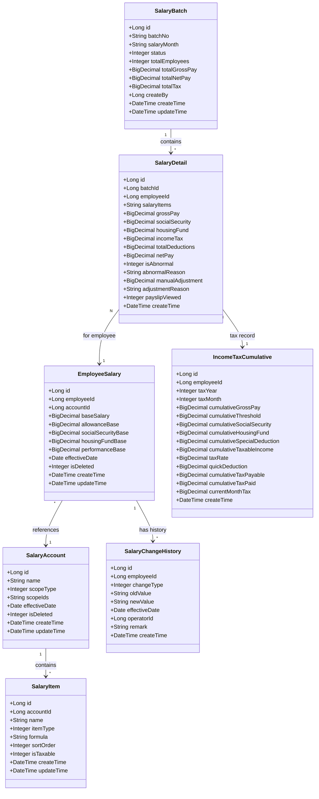
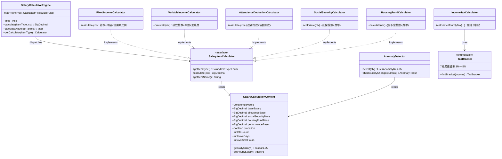
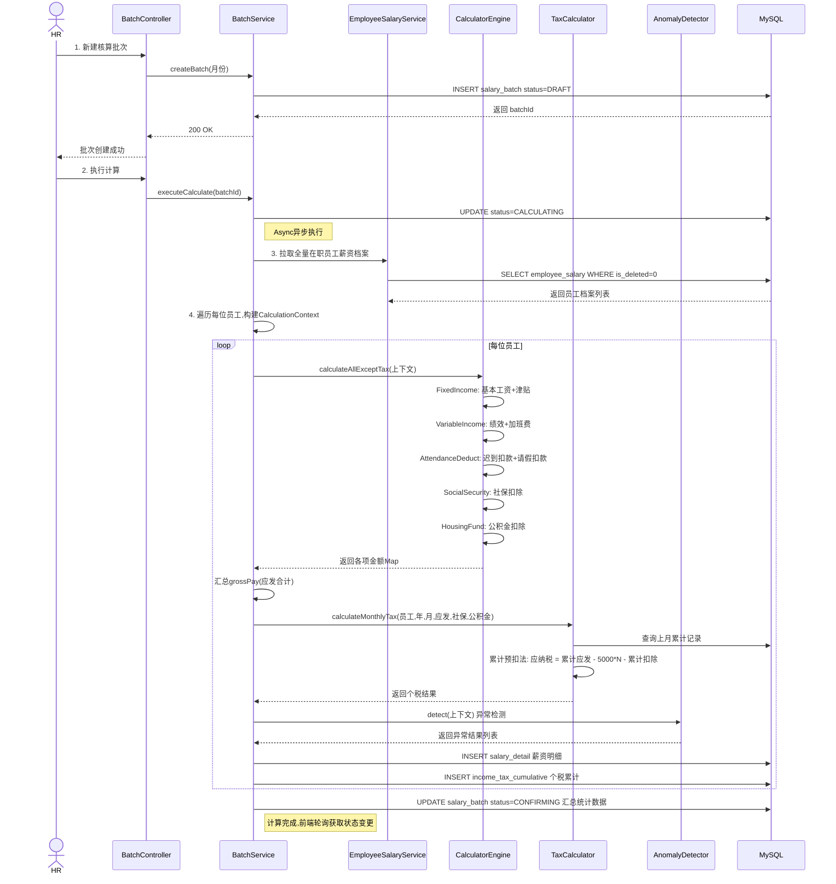
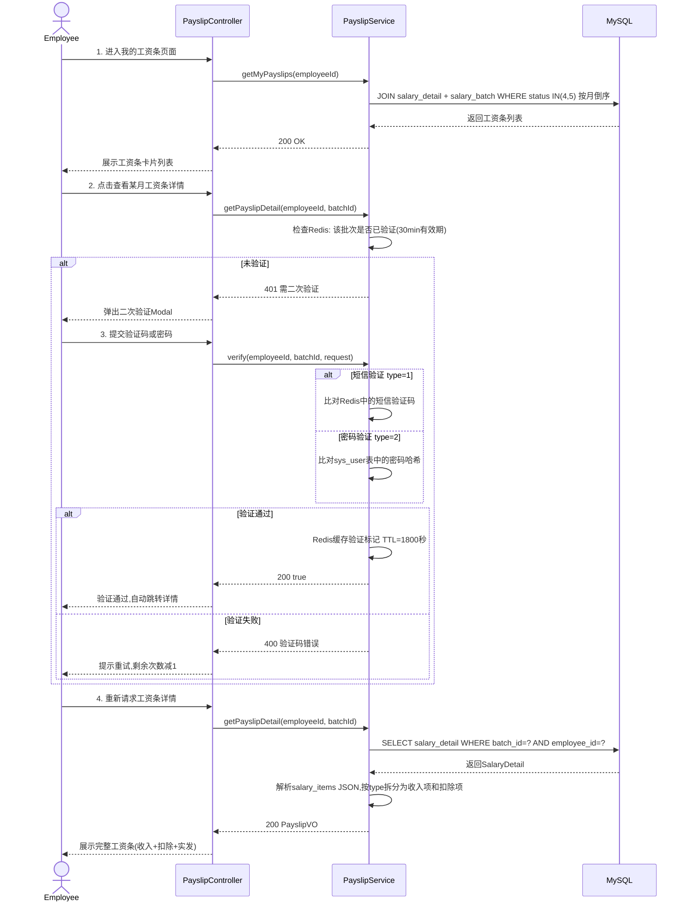

# 薪资管理模块 — 后端系分文档

**版本**：1.0 | **日期**：2026-07-13 | **作者**：—

---

## 变更记录

记录每次修订的内容，方便追溯。

| 日期 | 版本 | 修订说明 | 作者 |
|------|------|----------|------|
| 2026-07-13 | 1.0 | 初稿 | — |

---

## 项目背景

对本次项目的背景以及目标进行描述，方便开发者理解需求，对齐上下文。

本模块来源于 HRMS（人资管理系统）产品规格说明书中第 7 章——薪资管理。当前公司薪资核算依赖 Excel 手工操作，存在公式复杂易出错、个税计算繁琐、审批不透明、工资条发放不及时等问题。本模块旨在建立统一的薪资管理体系，涵盖薪资账套配置、员工薪资档案维护、月度薪资核算流转（含自动计算、异常检测、审批流程）、工资条员工自助查询、以及 AntV 数据可视化看板，为 HR 和财务提供高效、准确的薪资管理工具。

## 相关资料

| 文档 | 说明 |
|------|------|
| 人资管理系统（HRMS）详细产品规格说明书 | 第7章 薪资管理 |
| 前端系分-薪资管理模块.md | 前端系统设计 |
| 01-权限管理模块-系分.md | 权限体系 |
| 02-组织架构管理模块-系分.md | 组织架构 |

## 参与人

| 角色 | 成员 |
|------|------|
| 项目负责人 | — |
| 产品经理 | — |
| 设计师 | — |
| 工程师 | — |

---

## 功能模块

描述薪资管理涉及的功能与场景。

本模块核心功能包括：

- **薪资账套管理**：定义薪资计算模板，配置工资构成项目（固定收入/变动收入/考勤扣款/社保/公积金/个税）和计算规则，支持按部门/职位/职级指定适用范围
- **员工薪资档案**：每个员工独立维护薪资档案（适用账套、基本工资、津贴基数、社保公积金基数、绩效基数），更新自动记录调薪历史
- **月度薪资核算**：批次创建→异步自动计算（遍历员工取档案取考勤数据应用账套公式逐项计算）→核算预览→异常检测→手动调整→提交审批→审批流转→标记已发放
- **工资条（员工自助）**：仅可查看自己的工资条，审批通过后可见，首次查看需二次验证（短信验证码/密码），展示收入明细/扣除明细/实发金额
- **薪资统计（AntV 可视化）**：薪资成本趋势折线图、部门薪资分布柱状图、薪资构成占比饼图、社保公积金对比、薪资变动分布直方图
- **个税累计预扣法**：每月累计计算应纳税所得额，按 7 级累进税率表计算当月个税

### 功能模块树

```
薪资管理
├── 薪资账套管理
│   ├── 账套 CRUD（新建/编辑/删除/查询列表/查询详情）
│   ├── 工资项目管理（添加/编辑/删除/拖拽排序）
│   └── 适用范围配置（按部门/职位/职级，多选）
├── 员工薪资档案
│   ├── 薪资档案查询与更新
│   ├── 调薪历史自动记录（变更类型/新旧值对比/操作人/备注）
│   └── 试用期薪资比例管理
├── 月度薪资核算
│   ├── 核算批次创建（选择核算月份）
│   ├── 异步自动计算（策略模式计算引擎 + 累计预扣法个税）
│   ├── 核算预览（分页明细表格 + 汇总统计）
│   ├── 异常检测（请假>15天/加班>50h → 黄色预警；变动>30% → 红色预警；无档案 → 红色阻断）
│   ├── 手动调整（正补发/负扣减 + 原因备注）
│   ├── 提交审批 → 审批通过 / 驳回（需填原因）
│   └── 标记已发放 → 归档
├── 工资条（员工自助）
│   ├── 我的工资条列表（按月倒序，仅已通过/已发放批次可见）
│   ├── 二次验证（短信验证码 / 登录密码）
│   ├── 工资条详情（收入项 + 扣除项 + 应发/应扣小计 + 实发金额）
│   └── 个人薪资趋势（近N个月实发工资折线图数据）
└── 薪资统计（AntV 可视化数据源）
    ├── 薪资成本月度趋势（近6个月应发/实发总额 + 环比变动率）
    ├── 部门薪资分布（总额/人均/人数）
    ├── 薪资构成占比（各项名称/金额/百分比）
    ├── 社保公积金对比（各部门社保总额 vs 公积金总额）
    └── 薪资变动分布（变动率区间/员工人数）
```

---

## 流程图

对薪资管理涉及的核心流程进行梳理。

### 5-1 月度薪资核算全流程

```
HR新建核算批次（选择月份）
         │
         ▼
┌──────────────────────────────────────┐
│ 数据准备                              │
│ - 拉取全量在职员工薪资档案            │
│ - 拉取当月考勤数据（迟到/请假/加班）  │
│ - 拉取员工适用账套及工资项目配置      │
│ - 拉取上月个税累计记录               │
└──────────────────┬───────────────────┘
                   │
                   ▼
┌──────────────────────────────────────┐
│ 异步自动计算（@Async）                │
│ 遍历每位员工：                        │
│ 1. 取薪资档案 → 构建 SalaryCalcCtx   │
│ 2. 取考勤数据 → 填充迟到/请假/加班    │
│ 3. 策略模式计算引擎逐项计算：         │
│    - 固定收入(1): 基本工资+津贴×试用期比例│
│    - 变动收入(2): 绩效基数×系数+加班费  │
│    - 考勤扣款(3): 迟到N次×50+日工资×请假天数│
│    - 社保扣除(4): 基数×费率(负数)     │
│    - 公积金扣除(5): 基数×费率(负数)   │
│ 4. 累计预扣法计算个税(6)              │
│ 5. 异常检测（AnomalyDetector）        │
│ 6. 写入 salary_detail + income_tax_cumulative│
└──────────────────┬───────────────────┘
                   │
                   ▼
┌──────────────────────────────────────┐
│ 核算预览（HR确认）                    │
│ - 分页表格展示全员薪资明细            │
│ - 异常数据标红/黄/阻断标记            │
│ - 支持手动调整（正补发/负扣减）       │
└──────────────────┬───────────────────┘
                   │
              ┌────┴────┐
              │         │
         确认无误     需要调整
              │         │
              ▼         ▼
         提交审批    添加调整项→重新计算
              │
              ▼
┌──────────────────────────────────────┐
│ 审批流程                              │
│ HR提交 → 财务审核 → [老板审批]        │
└──────────────────┬───────────────────┘
                   │
                   ▼
              审批通过
                   │
                   ▼
         工资条对员工可见
                   │
                   ▼
         实际发放后标记已发放
```

### 5-2 薪资批次状态流转

```
草稿(0) ─→ 计算中(1) ─→ 待确认(2) ─→ 审批中(3) ─→ 已通过(4) ─→ 已发放(5)
                                  │                    │
                                  │                    └──→ 已驳回(6) → HR修改后重新提交→待确认(2)
                                  │
                                  └── 手动调整后可重新计算回到计算中(1)
```

| 状态码 | 状态 | 说明 | 可执行操作 | 操作角色 |
|--------|------|------|-----------|----------|
| 0 | 草稿（DRAFT）| 刚创建，数据准备中 | 删除、执行计算 | HR |
| 1 | 计算中（CALCULATING）| 系统异步计算中 | 等待（前端轮询）| — |
| 2 | 待确认（CONFIRMING）| 计算完成，等待HR确认 | 查看预览、查看异常、调整、提交审批 | HR |
| 3 | 审批中（APPROVING）| 已提交财务审批 | 查看进度 | HR/财务 |
| 4 | 已通过（APPROVED）| 审批通过，工资条可见 | 发放确认 | 财务 |
| 5 | 已发放（PAID）| 实际工资已发放 | 归档 | — |
| 6 | 已驳回（REJECTED）| 审批未通过 | 修改后重新提交 | HR |

### 5-3 工资条查看流程（含二次验证）

```
员工进入"我的工资条"页面
     │
     ▼
系统返回工资条列表（按月倒序）
仅展示状态=已通过/已发放的批次
     │
     ▼
员工点击某月工资条"查看详情"
     │
     ▼
是否已完成二次验证？（30分钟有效期）
     │
  ┌──┴──────────┐
  │              │
 已验证         未验证
  │              │
  ▼              ▼
直接展示    弹出二次验证 Modal
工资条详情       │
            ┌────┴────┐
            │         │
       短信验证码   登录密码
       (优先)     (降级)
            │         │
            └────┬────┘
                 │
            验证通过？
            ┌────┴────┐
            │         │
           通过      失败
            │         │
            ▼         ▼
      标记已验证   提示错误
      进入详情     (允许重试3次)
```

---

## UML 图

### 薪资管理核心领域模型



**枚举说明**：

| 枚举 | 值 | 说明 |
|------|-----|------|
| **SalaryItemType** | 1~6 | FIXED_INCOME(1) 固定收入 / VARIABLE_INCOME(2) 变动收入 / ATTENDANCE_DEDUCT(3) 考勤扣款 / SOCIAL_SECURITY(4) 社保扣除 / HOUSING_FUND(5) 公积金扣除 / INCOME_TAX(6) 个税 |
| **BatchStatus** | 0~6 | DRAFT(0) 草稿 / CALCULATING(1) 计算中 / CONFIRMING(2) 待确认 / APPROVING(3) 审批中 / APPROVED(4) 已通过 / PAID(5) 已发放 / REJECTED(6) 已驳回 |
| **AbnormalLevel** | 0~3 | NORMAL(0) 正常 / WARNING(1) 黄色预警 / ERROR(2) 红色预警 / BLOCKED(3) 红色阻断 |
| **ChangeType** | 1~5 | SALARY_ADJUST(1) 调薪 / ACCOUNT_CHANGE(2) 账套变更 / BASE_ADJUST(3) 基数调整 / REGULAR_ADJUST(4) 转正调薪 / TRANSFER_ADJUST(5) 调岗调薪 |

### 薪资计算引擎架构（策略模式）



---

## 时序图

### 薪资核算执行流程



### 工资条查询与二次验证时序



---

## 数据库设计

### 薪资账套表 salary_account

```sql
CREATE TABLE IF NOT EXISTS `salary_account` (
    `id`                BIGINT UNSIGNED   NOT NULL AUTO_INCREMENT COMMENT '主键ID',
    `name`              VARCHAR(64)       NOT NULL COMMENT '账套名称',
    `scope_type`        TINYINT           NOT NULL COMMENT '适用范围类型：1=部门 2=职位 3=职级',
    `scope_ids`         VARCHAR(512)               COMMENT '适用范围ID集合，JSON数组格式，如[2,3,4]',
    `effective_date`    DATE              NOT NULL COMMENT '生效日期',
    `is_deleted`        TINYINT           NOT NULL DEFAULT 0 COMMENT '逻辑删除：0=未删除 1=已删除',
    `create_time`       DATETIME          NOT NULL DEFAULT CURRENT_TIMESTAMP COMMENT '创建时间',
    `update_time`       DATETIME          NOT NULL DEFAULT CURRENT_TIMESTAMP ON UPDATE CURRENT_TIMESTAMP COMMENT '更新时间',
    PRIMARY KEY (`id`),
    KEY `idx_account_name` (`name`),
    KEY `idx_account_scope_type` (`scope_type`),
    KEY `idx_account_effective_date` (`effective_date`)
) DEFAULT CHARACTER SET = utf8mb4 COMMENT = '薪资账套表';
```

### 工资项目表 salary_item

```sql
CREATE TABLE IF NOT EXISTS `salary_item` (
    `id`                BIGINT UNSIGNED   NOT NULL AUTO_INCREMENT COMMENT '主键ID',
    `account_id`        BIGINT UNSIGNED   NOT NULL COMMENT '所属账套ID，关联salary_account.id',
    `name`              VARCHAR(64)       NOT NULL COMMENT '项目名称，如"基本工资""养老保险"',
    `item_type`         TINYINT           NOT NULL COMMENT '项目类型：1=固定收入 2=变动收入 3=考勤扣款 4=社保扣除 5=公积金扣除 6=个税',
    `formula`           VARCHAR(256)               COMMENT '计算公式/规则描述，如"base_salary * 1.0""基数 * 0.08"',
    `sort_order`        INT               NOT NULL DEFAULT 0 COMMENT '排序序号，影响工资条展示顺序',
    `is_taxable`        TINYINT           NOT NULL DEFAULT 1 COMMENT '是否计入个税计算基数：0=否 1=是',
    `create_time`       DATETIME          NOT NULL DEFAULT CURRENT_TIMESTAMP COMMENT '创建时间',
    `update_time`       DATETIME          NOT NULL DEFAULT CURRENT_TIMESTAMP ON UPDATE CURRENT_TIMESTAMP COMMENT '更新时间',
    PRIMARY KEY (`id`),
    KEY `idx_item_account_id` (`account_id`),
    KEY `idx_item_type` (`item_type`),
    KEY `idx_item_sort` (`sort_order`)
) DEFAULT CHARACTER SET = utf8mb4 COMMENT = '工资项目表';
```

### 员工薪资档案表 employee_salary

```sql
CREATE TABLE IF NOT EXISTS `employee_salary` (
    `id`                    BIGINT UNSIGNED   NOT NULL AUTO_INCREMENT COMMENT '主键ID',
    `employee_id`           BIGINT UNSIGNED   NOT NULL COMMENT '员工ID，关联employee.id',
    `account_id`            BIGINT UNSIGNED   NOT NULL COMMENT '适用薪资账套ID，关联salary_account.id',
    `base_salary`           DECIMAL(12,2)     NOT NULL COMMENT '基本工资（元）',
    `allowance_base`        DECIMAL(12,2)     NOT NULL DEFAULT 0.00 COMMENT '津贴基数（元）',
    `social_security_base`  DECIMAL(12,2)     NOT NULL COMMENT '社保缴费基数（元）',
    `housing_fund_base`     DECIMAL(12,2)     NOT NULL COMMENT '公积金缴费基数（元）',
    `performance_base`      DECIMAL(12,2)              COMMENT '绩效基数（元）',
    `effective_date`        DATE              NOT NULL COMMENT '生效日期',
    `is_deleted`            TINYINT           NOT NULL DEFAULT 0 COMMENT '逻辑删除：0=未删除 1=已删除',
    `create_time`           DATETIME          NOT NULL DEFAULT CURRENT_TIMESTAMP COMMENT '创建时间',
    `update_time`           DATETIME          NOT NULL DEFAULT CURRENT_TIMESTAMP ON UPDATE CURRENT_TIMESTAMP COMMENT '更新时间',
    PRIMARY KEY (`id`),
    UNIQUE KEY `uk_employee_salary` (`employee_id`, `is_deleted`),
    KEY `idx_employee_salary_employee` (`employee_id`),
    KEY `idx_employee_salary_account` (`account_id`),
    KEY `idx_employee_salary_effective` (`effective_date`)
) DEFAULT CHARACTER SET = utf8mb4 COMMENT = '员工薪资档案表';
```

### 调薪历史表 salary_change_history

```sql
CREATE TABLE IF NOT EXISTS `salary_change_history` (
    `id`                BIGINT UNSIGNED   NOT NULL AUTO_INCREMENT COMMENT '主键ID',
    `employee_id`       BIGINT UNSIGNED   NOT NULL COMMENT '员工ID，关联employee.id',
    `change_type`       TINYINT           NOT NULL COMMENT '变更类型：1=调薪 2=账套变更 3=基数调整 4=转正调薪 5=调岗调薪',
    `old_value`         VARCHAR(1024)              COMMENT '变更前值，JSON格式',
    `new_value`         VARCHAR(1024)              COMMENT '变更后值，JSON格式',
    `effective_date`    DATE              NOT NULL COMMENT '生效日期',
    `operator_id`       BIGINT UNSIGNED   NOT NULL COMMENT '操作人用户ID，关联sys_user.id',
    `remark`            VARCHAR(512)               COMMENT '备注',
    `create_time`       DATETIME          NOT NULL DEFAULT CURRENT_TIMESTAMP COMMENT '创建时间',
    PRIMARY KEY (`id`),
    KEY `idx_history_employee` (`employee_id`),
    KEY `idx_history_type` (`change_type`),
    KEY `idx_history_date` (`effective_date`)
) DEFAULT CHARACTER SET = utf8mb4 COMMENT = '调薪历史表';
```

### 薪资核算批次表 salary_batch

```sql
CREATE TABLE IF NOT EXISTS `salary_batch` (
    `id`                BIGINT UNSIGNED   NOT NULL AUTO_INCREMENT COMMENT '主键ID',
    `batch_no`          VARCHAR(32)       NOT NULL COMMENT '批次编号，如BATCH202607001',
    `salary_month`      VARCHAR(7)        NOT NULL COMMENT '核算月份，格式yyyy-MM，如2026-07',
    `status`            TINYINT           NOT NULL DEFAULT 0 COMMENT '状态：0=草稿 1=计算中 2=待确认 3=审批中 4=已通过 5=已发放 6=已驳回',
    `total_employees`   INT               NOT NULL DEFAULT 0 COMMENT '核算员工总数',
    `total_gross_pay`   DECIMAL(14,2)     NOT NULL DEFAULT 0.00 COMMENT '应发合计（元）',
    `total_net_pay`     DECIMAL(14,2)     NOT NULL DEFAULT 0.00 COMMENT '实发合计（元）',
    `total_tax`         DECIMAL(14,2)     NOT NULL DEFAULT 0.00 COMMENT '个税合计（元）',
    `create_by`         BIGINT UNSIGNED   NOT NULL COMMENT '创建人用户ID，关联sys_user.id',
    `create_time`       DATETIME          NOT NULL DEFAULT CURRENT_TIMESTAMP COMMENT '创建时间',
    `update_time`       DATETIME          NOT NULL DEFAULT CURRENT_TIMESTAMP ON UPDATE CURRENT_TIMESTAMP COMMENT '更新时间',
    PRIMARY KEY (`id`),
    UNIQUE KEY `uk_batch_no` (`batch_no`),
    KEY `idx_batch_status` (`status`),
    KEY `idx_batch_month` (`salary_month`),
    KEY `idx_batch_create_by` (`create_by`)
) DEFAULT CHARACTER SET = utf8mb4 COMMENT = '薪资核算批次表';
```

### 薪资明细表 salary_detail

```sql
CREATE TABLE IF NOT EXISTS `salary_detail` (
    `id`                    BIGINT UNSIGNED   NOT NULL AUTO_INCREMENT COMMENT '主键ID',
    `batch_id`              BIGINT UNSIGNED   NOT NULL COMMENT '所属批次ID，关联salary_batch.id',
    `employee_id`           BIGINT UNSIGNED   NOT NULL COMMENT '员工ID，关联employee.id',
    `salary_items`          TEXT                       COMMENT '工资项明细，JSON数组：[{"name":"基本工资","type":1,"amount":10000.00},...]',
    `gross_pay`             DECIMAL(12,2)     NOT NULL COMMENT '应发工资（收入合计）',
    `social_security`       DECIMAL(12,2)     NOT NULL DEFAULT 0.00 COMMENT '社保扣除合计',
    `housing_fund`          DECIMAL(12,2)     NOT NULL DEFAULT 0.00 COMMENT '公积金扣除合计',
    `income_tax`            DECIMAL(12,2)     NOT NULL DEFAULT 0.00 COMMENT '个人所得税',
    `total_deductions`      DECIMAL(12,2)     NOT NULL DEFAULT 0.00 COMMENT '扣除合计（社保+公积金+个税+考勤扣款）',
    `net_pay`               DECIMAL(12,2)     NOT NULL COMMENT '实发工资',
    `is_abnormal`           TINYINT           NOT NULL DEFAULT 0 COMMENT '异常等级：0=正常 1=黄色预警 2=红色预警 3=红色阻断',
    `abnormal_reason`       VARCHAR(512)               COMMENT '异常原因说明',
    `manual_adjustment`     DECIMAL(12,2)              COMMENT '手动调整金额，正=补发，负=扣减',
    `adjustment_reason`     VARCHAR(256)               COMMENT '调整原因',
    `payslip_viewed`        TINYINT           NOT NULL DEFAULT 0 COMMENT '工资条是否已查看：0=未查看 1=已查看',
    `create_time`           DATETIME          NOT NULL DEFAULT CURRENT_TIMESTAMP COMMENT '创建时间',
    PRIMARY KEY (`id`),
    KEY `idx_detail_batch` (`batch_id`),
    KEY `idx_detail_employee` (`employee_id`),
    KEY `idx_detail_batch_employee` (`batch_id`, `employee_id`),
    KEY `idx_detail_abnormal` (`is_abnormal`)
) DEFAULT CHARACTER SET = utf8mb4 COMMENT = '薪资明细表';
```

### 个税累计表 income_tax_cumulative

```sql
CREATE TABLE IF NOT EXISTS `income_tax_cumulative` (
    `id`                          BIGINT UNSIGNED   NOT NULL AUTO_INCREMENT COMMENT '主键ID',
    `employee_id`                 BIGINT UNSIGNED   NOT NULL COMMENT '员工ID，关联employee.id',
    `tax_year`                    INT               NOT NULL COMMENT '纳税年度，如2026',
    `tax_month`                   INT               NOT NULL COMMENT '纳税月份，1-12',
    `cumulative_gross_pay`        DECIMAL(14,2)     NOT NULL COMMENT '累计应发工资（元）',
    `cumulative_threshold`        DECIMAL(14,2)     NOT NULL COMMENT '累计起征点（5000×月份）',
    `cumulative_social_security`  DECIMAL(14,2)     NOT NULL DEFAULT 0.00 COMMENT '累计社保扣除（元）',
    `cumulative_housing_fund`     DECIMAL(14,2)     NOT NULL DEFAULT 0.00 COMMENT '累计公积金扣除（元）',
    `cumulative_special_deduction` DECIMAL(14,2)    NOT NULL DEFAULT 0.00 COMMENT '累计专项附加扣除（元）',
    `cumulative_taxable_income`   DECIMAL(14,2)     NOT NULL COMMENT '累计应纳税所得额（元）',
    `tax_rate`                    DECIMAL(5,4)      NOT NULL COMMENT '适用税率，如0.1000=10%',
    `quick_deduction`             DECIMAL(12,2)     NOT NULL COMMENT '速算扣除数（元）',
    `cumulative_tax_payable`      DECIMAL(14,2)     NOT NULL COMMENT '累计应缴个税（元）',
    `cumulative_tax_paid`         DECIMAL(14,2)     NOT NULL COMMENT '累计已缴个税（元）',
    `current_month_tax`           DECIMAL(12,2)     NOT NULL COMMENT '当月应缴个税（元）',
    `create_time`                 DATETIME          NOT NULL DEFAULT CURRENT_TIMESTAMP COMMENT '创建时间',
    PRIMARY KEY (`id`),
    UNIQUE KEY `uk_employee_year_month` (`employee_id`, `tax_year`, `tax_month`),
    KEY `idx_tax_employee` (`employee_id`)
) DEFAULT CHARACTER SET = utf8mb4 COMMENT = '个税累计表';
```

### 7 级累进税率表（代码内置，非数据库表）

| 级数 | 累计应纳税所得额区间 | 税率 | 速算扣除数 |
|------|---------------------|------|-----------|
| 1 | ≤ 36,000 | 3% | 0 |
| 2 | 36,000 ~ 144,000 | 10% | 2,520 |
| 3 | 144,000 ~ 300,000 | 20% | 16,920 |
| 4 | 300,000 ~ 420,000 | 25% | 31,920 |
| 5 | 420,000 ~ 660,000 | 30% | 52,920 |
| 6 | 660,000 ~ 960,000 | 35% | 85,920 |
| 7 | > 960,000 | 45% | 181,920 |

---

## API 设计

### 通用说明

| 项目 | 说明 |
|------|------|
| 基础路径 | `/api` |
| 认证方式 | Session-Cookie（`JSESSIONID`），Axios 需配置 `withCredentials: true` |
| 响应格式 | `{"code": 0, "message": "success", "data": {...}}` |
| 成功判定 | `code = 0` |
| 分页格式 | `{"total": N, "page": P, "size": S, "records": [...]}` |

---

### 1. 薪资账套 — 查询列表

```
GET /api/v1/salary-accounts
```

**请求参数**

| 参数 | 类型 | 必填 | 描述 |
|------|------|------|------|
| name | String | 否 | 账套名称（模糊搜索）|
| scope_type | Integer | 否 | 适用范围类型：1=部门 2=职位 3=职级 |

**响应格式**

```json
{
  "code": 0,
  "message": "success",
  "data": [
    {
      "id": 1,
      "name": "标准职员工资",
      "scope_type": 1,
      "scope_type_label": "部门",
      "scope_ids": "[2,3,4]",
      "effective_date": "2026-01-01",
      "create_time": "2026-01-01T09:00:00",
      "items": [
        {
          "id": 1,
          "account_id": 1,
          "name": "基本工资",
          "item_type": 1,
          "item_type_label": "固定收入",
          "formula": "base_salary * 1.0",
          "sort_order": 1,
          "is_taxable": 1
        }
      ]
    }
  ]
}
```

---

### 2. 薪资账套 — 查询详情（含工资项目列表）

```
GET /api/v1/salary-accounts/{id}
```

**请求参数**

| 参数 | 类型 | 必填 | 描述 |
|------|------|------|------|
| id | Long | 是 | 账套ID（路径参数）|

**响应格式**：同列表单项结构，`items` 按 `sort_order` 升序排列。

---

### 3. 薪资账套 — 新建

```
POST /api/v1/salary-accounts
```

**请求参数**

| 参数 | 类型 | 必填 | 描述 |
|------|------|------|------|
| name | String | 是 | 账套名称 |
| scope_type | Integer | 是 | 适用范围类型：1=部门 2=职位 3=职级 |
| scope_ids | Long[] | 是 | 适用范围ID集合 |
| effective_date | Date | 是 | 生效日期 |
| items | Object[] | 否 | 工资项目列表（可创建时同步添加）|

items 子字段：

| 参数 | 类型 | 必填 | 描述 |
|------|------|------|------|
| name | String | 是 | 项目名称 |
| item_type | Integer | 是 | 项目类型：1~6 |
| formula | String | 否 | 计算公式/规则描述 |
| sort_order | Integer | 是 | 排序序号 |
| is_taxable | Integer | 是 | 是否计入个税：0=否 1=是 |

**请求示例**

```json
{
  "name": "标准职员工资",
  "scope_type": 1,
  "scope_ids": [2, 3, 4],
  "effective_date": "2026-01-01",
  "items": [
    {"name": "基本工资", "item_type": 1, "formula": "base_salary * 1.0", "sort_order": 1, "is_taxable": 1},
    {"name": "岗位津贴", "item_type": 1, "formula": "allowance_base * 1.0", "sort_order": 2, "is_taxable": 1},
    {"name": "绩效奖金", "item_type": 2, "formula": "performance_base * performance_coefficient", "sort_order": 3, "is_taxable": 1},
    {"name": "加班费", "item_type": 2, "formula": "hourly_salary * overtime_multiplier * overtime_hours", "sort_order": 4, "is_taxable": 1},
    {"name": "迟到扣款", "item_type": 3, "formula": "50 * late_count", "sort_order": 5, "is_taxable": 0},
    {"name": "请假扣款", "item_type": 3, "formula": "daily_salary * leave_days", "sort_order": 6, "is_taxable": 0},
    {"name": "养老保险", "item_type": 4, "formula": "social_security_base * 0.08", "sort_order": 7, "is_taxable": 0},
    {"name": "医疗保险", "item_type": 4, "formula": "social_security_base * 0.02", "sort_order": 8, "is_taxable": 0},
    {"name": "失业保险", "item_type": 4, "formula": "social_security_base * 0.005", "sort_order": 9, "is_taxable": 0},
    {"name": "住房公积金", "item_type": 5, "formula": "housing_fund_base * 0.12", "sort_order": 10, "is_taxable": 0},
    {"name": "个人所得税", "item_type": 6, "formula": "累计预扣法", "sort_order": 11, "is_taxable": 0}
  ]
}
```

**响应格式**

```json
{
  "code": 0,
  "message": "success",
  "data": 1
}
```

---

### 4. 薪资账套 — 编辑

```
PUT /api/v1/salary-accounts/{id}
```

请求参数同新建（不含 items），`id` 通过路径传入。仅更新账套基本信息，不涉及工资项目变更。

---

### 5. 薪资账套 — 删除

```
DELETE /api/v1/salary-accounts/{id}
```

**说明**：逻辑删除（`is_deleted=1`），同时级联删除关联的工资项目。如账套已被员工引用，应拒绝删除并提示。

---

### 6. 工资项目 — 添加/编辑/删除/排序

| 方法 | 路径 | 功能 |
|------|------|------|
| GET | `/api/v1/salary-accounts/{id}/items` | 获取账套下工资项目列表 |
| POST | `/api/v1/salary-accounts/{id}/items` | 添加工资项目 |
| PUT | `/api/v1/salary-accounts/items/{itemId}` | 编辑工资项目 |
| DELETE | `/api/v1/salary-accounts/items/{itemId}` | 删除工资项目 |
| PUT | `/api/v1/salary-accounts/{id}/items/sort` | 调整排序（body: `{"item_ids": [3,1,2]}`）|

---

### 7. 员工薪资档案 — 查询

```
GET /api/v1/employee-salaries/{employeeId}
```

**响应格式**

```json
{
  "code": 0,
  "message": "success",
  "data": {
    "id": 1,
    "employee_id": 101,
    "account_id": 1,
    "account_name": "标准职员工资",
    "base_salary": 10000.00,
    "allowance_base": 2000.00,
    "social_security_base": 10000.00,
    "housing_fund_base": 10000.00,
    "performance_base": 3000.00,
    "effective_date": "2026-01-01",
    "create_time": "2026-01-01T09:00:00",
    "update_time": "2026-01-01T09:00:00"
  }
}
```

**说明**：`salaryInfo` 仅 HR 专员和财务专员可查看完整值；部门主管仅可见本部门员工的非薪资字段。

---

### 8. 员工薪资档案 — 更新（自动记录调薪历史）

```
PUT /api/v1/employee-salaries/{employeeId}
```

**请求参数**

| 参数 | 类型 | 必填 | 描述 |
|------|------|------|------|
| account_id | Long | 是 | 适用账套ID |
| base_salary | BigDecimal | 是 | 基本工资（元）|
| allowance_base | BigDecimal | 是 | 津贴基数（元）|
| social_security_base | BigDecimal | 是 | 社保基数（元）|
| housing_fund_base | BigDecimal | 是 | 公积金基数（元）|
| performance_base | BigDecimal | 否 | 绩效基数（元）|
| effective_date | Date | 是 | 生效日期 |
| remark | String | 是 | 变更备注 |

**说明**：更新时自动比对变更前后的值，将差异写入 `salary_change_history` 表，`change_type` 自动识别。

---

### 9. 员工调薪历史 — 查询

```
GET /api/v1/employee-salaries/{employeeId}/history
```

**响应格式**

```json
{
  "code": 0,
  "message": "success",
  "data": [
    {
      "id": 1,
      "employee_id": 101,
      "change_type": 1,
      "change_type_label": "调薪",
      "old_value": "{\"base_salary\":10000,\"allowance_base\":2000}",
      "new_value": "{\"base_salary\":12000,\"allowance_base\":2000}",
      "effective_date": "2026-04-01",
      "operator_id": 2,
      "operator_name": "HR专员",
      "remark": "年度调薪",
      "create_time": "2026-03-25T14:30:00"
    }
  ]
}
```

---

### 10. 月度薪资核算 — 批次列表

```
GET /api/v1/salary-batches
```

**请求参数**

| 参数 | 类型 | 必填 | 描述 |
|------|------|------|------|
| salary_month | String | 否 | 核算月份，格式 yyyy-MM |
| status | Integer | 否 | 批次状态：0~6 |
| page | Integer | 否 | 页码，默认1 |
| size | Integer | 否 | 每页条数，默认20 |

**响应格式**

```json
{
  "code": 0,
  "message": "success",
  "data": {
    "total": 12,
    "page": 1,
    "size": 20,
    "records": [
      {
        "id": 1,
        "batch_no": "BATCH202607001",
        "salary_month": "2026-07",
        "status": 2,
        "status_label": "待确认",
        "total_employees": 150,
        "total_gross_pay": 2250000.00,
        "total_net_pay": 1875000.00,
        "total_tax": 125000.00,
        "create_by": 2,
        "create_time": "2026-07-01T09:00:00",
        "update_time": "2026-07-01T09:05:00"
      }
    ]
  }
}
```

---

### 11. 月度薪资核算 — 新建批次

```
POST /api/v1/salary-batches
```

**请求参数**

| 参数 | 类型 | 必填 | 描述 |
|------|------|------|------|
| salary_month | String | 是 | 核算月份，格式 yyyy-MM |

**说明**：创建后状态为 DRAFT(0)，批次编号由系统自动生成（格式：`BATCH` + yyyyMM + 3位序号）。

---

### 12. 月度薪资核算 — 执行计算

```
POST /api/v1/salary-batches/{id}/calculate
```

**说明**：调用后立即返回，批次状态变为 CALCULATING(1)。实际计算在 `@Async` 线程池中执行。前端需轮询批次列表接口（建议每3秒），直到状态变为 CONFIRMING(2)，轮询超时（5分钟）提示用户手动刷新。

---

### 13. 月度薪资核算 — 预览结果

```
GET /api/v1/salary-batches/{id}/preview?page=1&size=20
```

**响应格式**

```json
{
  "code": 0,
  "message": "success",
  "data": {
    "batch": {
      "id": 1,
      "batch_no": "BATCH202607001",
      "salary_month": "2026-07",
      "status": 2,
      "status_label": "待确认",
      "total_employees": 150,
      "total_gross_pay": 2250000.00,
      "total_net_pay": 1875000.00,
      "total_tax": 125000.00
    },
    "records": [
      {
        "id": 1,
        "employee_id": 101,
        "employee_no": "202407TECH001",
        "employee_name": "张三",
        "department_name": "技术部",
        "salary_items": [
          {"name": "基本工资", "type": 1, "amount": 10000.00},
          {"name": "岗位津贴", "type": 1, "amount": 2000.00},
          {"name": "绩效奖金", "type": 2, "amount": 3600.00}
        ],
        "gross_pay": 15600.00,
        "social_security": 1575.00,
        "housing_fund": 1440.00,
        "income_tax": 320.00,
        "total_deductions": 3835.00,
        "net_pay": 11765.00,
        "is_abnormal": 0,
        "abnormal_reason": null,
        "manual_adjustment": null,
        "adjustment_reason": null
      }
    ],
    "total": 150
  }
}
```

---

### 14. 月度薪资核算 — 查看异常项

```
GET /api/v1/salary-batches/{id}/anomalies
```

**响应格式**

```json
{
  "code": 0,
  "data": [
    {
      "detail_id": 15,
      "employee_id": 105,
      "employee_no": "202407TECH005",
      "employee_name": "李四",
      "department_name": "技术部",
      "is_abnormal": 2,
      "abnormal_reason": "薪资较上月变动超过30%（变动率：35%）",
      "abnormal_level_label": "红色预警"
    }
  ]
}
```

---

### 15. 月度薪资核算 — 手动调整

```
PUT /api/v1/salary-batches/{id}/adjust
```

**请求参数**

| 参数 | 类型 | 必填 | 描述 |
|------|------|------|------|
| detail_id | Long | 是 | 薪资明细ID |
| adjustment_amount | BigDecimal | 是 | 调整金额，正数为补发，负数为扣减 |
| adjustment_reason | String | 否 | 调整原因 |

---

### 16. 月度薪资核算 — 提交审批/审批通过/驳回/标记已发放

| 方法 | 路径 | 功能 | 请求参数 |
|------|------|------|----------|
| POST | `/api/v1/salary-batches/{id}/submit` | 提交审批 | 无 |
| POST | `/api/v1/salary-batches/{id}/approve` | 审批通过 | 无 |
| POST | `/api/v1/salary-batches/{id}/reject` | 驳回 | `{"reason": "驳回原因"}` |
| POST | `/api/v1/salary-batches/{id}/mark-paid` | 标记已发放 | 无 |

---

### 17. 工资条 — 我的工资条列表

```
GET /api/v1/payslips
```

**说明**：根据当前登录用户的 `employeeId` 获取工资条列表，仅返回状态为已通过(4)/已发放(5)的批次，按月倒序排列。

**响应格式**

```json
{
  "code": 0,
  "data": [
    {
      "batch_id": 1,
      "salary_month": "2026-07",
      "gross_pay": 15600.00,
      "net_pay": 11765.00,
      "status": 4,
      "status_label": "已通过",
      "payslip_viewed": 0
    }
  ]
}
```

---

### 18. 工资条 — 二次验证

```
POST /api/v1/payslips/{batchId}/verify
```

**请求参数**

| 参数 | 类型 | 必填 | 描述 |
|------|------|------|------|
| verify_type | Integer | 是 | 验证方式：1=短信验证码 2=登录密码 |
| verify_code | String | 是 | 验证码或密码 |

**说明**：验证通过后标记有效期 30 分钟，过期需重新验证。验证失败最多重试 3 次。

---

### 19. 工资条 — 详情

```
GET /api/v1/payslips/{batchId}
```

**说明**：需先通过二次验证。根据 `salary_items` JSON 字段自动拆分为 `income_items`（type=1,2 正数金额）和 `deduction_items`（type=3,4,5,6 负数金额取绝对值）。

**响应格式**

```json
{
  "code": 0,
  "data": {
    "salary_month": "2026-07",
    "employee_name": "张三",
    "employee_no": "202407TECH001",
    "department_name": "技术部",
    "income_items": [
      {"name": "基本工资", "type": 1, "amount": 10000.00},
      {"name": "岗位津贴", "type": 1, "amount": 2000.00},
      {"name": "绩效奖金", "type": 2, "amount": 3600.00}
    ],
    "deduction_items": [
      {"name": "事假扣款", "type": 3, "amount": 500.00},
      {"name": "养老保险", "type": 4, "amount": 640.00},
      {"name": "医疗保险", "type": 4, "amount": 160.00},
      {"name": "住房公积金", "type": 5, "amount": 960.00},
      {"name": "个人所得税", "type": 6, "amount": 320.00}
    ],
    "gross_pay": 15600.00,
    "total_deductions": 3835.00,
    "net_pay": 11765.00
  }
}
```

---

### 20. 个人薪资趋势

```
GET /api/v1/payslips/trend?months=6
```

**请求参数**

| 参数 | 类型 | 必填 | 描述 |
|------|------|------|------|
| months | Integer | 否 | 月数，默认6 |

---

### 21. 薪资统计 — 5 个可视化数据接口

| 方法 | 路径 | 功能 | 请求参数 |
|------|------|------|----------|
| GET | `/api/v1/salary-statistics/cost-trend` | 成本月度趋势 | `months`（默认6）|
| GET | `/api/v1/salary-statistics/dept-distribution` | 部门薪资分布 | `month`（yyyy-MM，不传取最新）|
| GET | `/api/v1/salary-statistics/composition` | 薪资构成占比 | `month` |
| GET | `/api/v1/salary-statistics/social-comparison` | 社保公积金对比 | `month` |
| GET | `/api/v1/salary-statistics/variation-distribution` | 薪资变动分布 | `month` |

**成本趋势响应示例**

```json
{
  "code": 0,
  "data": [
    {"month": "2026-02", "total_cost": 2200000.00, "yoy_change_rate": 0.05},
    {"month": "2026-03", "total_cost": 2250000.00, "yoy_change_rate": 0.02}
  ]
}
```

**部门分布响应示例**

```json
{
  "code": 0,
  "data": [
    {"department_name": "技术部", "total_salary": 850000.00, "avg_salary": 15000.00, "employee_count": 55},
    {"department_name": "市场部", "total_salary": 320000.00, "avg_salary": 12000.00, "employee_count": 26}
  ]
}
```

**构成占比响应示例**

```json
{
  "code": 0,
  "data": [
    {"item_name": "基本工资", "amount": 1500000.00, "percentage": 66.67},
    {"item_name": "岗位津贴", "amount": 300000.00, "percentage": 13.33}
  ]
}
```

**社保公积金对比响应示例**

```json
{
  "code": 0,
  "data": [
    {"department_name": "技术部", "total_social_security": 89250.00, "total_housing_fund": 102000.00}
  ]
}
```

**变动分布响应示例**

```json
{
  "code": 0,
  "data": [
    {"range_label": "-10%~0%", "range_start": -10, "range_end": 0, "employee_count": 45},
    {"range_label": "0%~10%", "range_start": 0, "range_end": 10, "employee_count": 60},
    {"range_label": "30%以上", "range_start": 30, "range_end": 999, "employee_count": 3}
  ]
}
```

---

## 关键技术设计

### 工资金额精度

所有金额计算统一使用 `BigDecimal`，保留 2 位小数，舍入模式 `ROUND_HALF_UP`。

| 常量 | 值 | 用途 |
|------|-----|------|
| 月计薪天数 | 21.75 | `日工资 = 基本工资 / 21.75` |
| 日工作小时 | 8 | `小时工资 = 日工资 / 8` |
| 月个税起征点 | 5000 | `累计起征点 = 5000 × 累计月份` |

### 个税累计预扣法

```
累计应纳税所得额 = 累计应发 - 累计起征点(5000×N月) - 累计社保 - 累计公积金 - 累计专项附加扣除
累计应缴个税 = 累计应纳税所得额 × 税率 - 速算扣除数
当月应缴个税 = max(累计应缴 - 累计已缴, 0)
```

**实现要点**：
- 每月查询上月 `income_tax_cumulative` 记录获取累计值
- 当年第一月（1月）无上月记录，各项累计从零开始
- `TaxBracket.findBracket()` 按 7 级累进税率表枚举查找适用区间
- 计算结果写入 `income_tax_cumulative` 表，唯一约束 `uk_employee_year_month` 防重

### 薪资计算引擎（策略模式）

每种工资项目类型对应一个独立的 `SalaryItemCalculator` 实现。引擎通过 `@PostConstruct` 自动扫描 Spring 容器中所有 `SalaryItemCalculator` Bean，按 `getItemType()` 注册到 `EnumMap<SalaryItemTypeEnum, SalaryItemCalculator>` 中，实现 O(1) 查找分发。

新增工资项目类型时，只需新增一个实现 `SalaryItemCalculator` 接口的 `@Component` 类，无需修改引擎代码。

### 异常检测规则

| 规则 | 条件 | 等级 | 说明 |
|------|------|------|------|
| 请假过多 | 当月请假天数 > 15天 | WARNING(1) | 黄色预警，提示 HR 核实 |
| 加班过多 | 当月加班小时 > 50h | WARNING(1) | 黄色预警，加班费异常偏高 |
| 薪资骤变 | 环比变动 > 30% | ERROR(2) | 红色预警，需 HR 确认 |
| 无薪资档案 | 新员工无 employee_salary 记录 | BLOCKED(3) | 红色阻断，无法计算 |

异常检测在计算流程中自动触发，结果写入 `salary_detail.is_abnormal` 和 `abnormal_reason`，预览页通过 `/anomalies` 接口集中查看。

### 异步计算设计

计算流程使用 `@Async("salaryTaskExecutor")` 异步执行，避免接口超时。前端通过轮询批次状态获取计算进度。计算任务需保证幂等性，重跑时先清理该批次已有明细记录再重新计算。

### 调薪历史自动记录

更新员工薪资档案时，自动比对变更前后的字段值，将差异以 JSON 格式写入 `salary_change_history` 表。`change_type` 根据变更字段自动识别（基本工资变动=调薪、账套ID变动=账套变更、基数变动=基数调整）。

### 数据权限集成

| 角色 | 薪资数据可见范围 |
|------|-----------------|
| 系统管理员 / HR 专员 | 全量员工薪资信息 |
| 财务专员 | 全量薪资核算批次和统计数据 |
| 部门主管 | 本部门及下属部门的员工薪资档案（不含银行账号等敏感字段）|
| 普通员工 | 仅自己的工资条 |

后端在接口层按角色做数据过滤，前端通过 `v-permission` 指令做 UI 层控制，双重保障防止薪资数据泄露。

---

## 排期

对研发时间计划进行排期。

| 阶段 | 内容 | 预估工期 |
|------|------|----------|
| 需求评审 | 评审产品规格，确认计算公式、审批规则、异常检测规则 | 1天 |
| 技术方案 | 完成系分文档评审，确认数据库设计与接口方案 | 1天 |
| 数据库开发 | 建表（7张）、索引优化、预置标准账套数据 | 1天 |
| 后端开发-账套管理 | 账套CRUD + 工资项目CRUD + 排序 | 2天 |
| 后端开发-员工薪资 | 薪资档案CRUD + 调薪历史自动记录 | 1.5天 |
| 后端开发-计算引擎 | 策略模式框架 + 6个计算器实现（固定/变动/考勤/社保/公积金/个税）| 3天 |
| 后端开发-核算批次 | 批次创建→异步计算→预览→异常检测→调整→审批流转→发放 | 3天 |
| 后端开发-工资条 | 列表+二次验证+详情+个人趋势 | 1.5天 |
| 后端开发-统计看板 | 5个统计查询接口（AntV 数据源）| 1.5天 |
| 前端开发 | 登录+权限框架+8个页面（详见前端系分）| 13.5天 |
| 联调测试 | 前后端联调、全流程场景测试（含并发计算测试、个税精度验证）| 3天 |
| 回归上线 | 全量回归、预发验证、正式上线 | 2天 |

**后端总预估工期**：约 14.5 个工作日
**前端总预估工期**：约 13.5 个工作日
**总预估工期**：约 24 个工作日（前后端并行开发）
